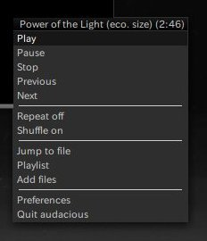

# Audacious control



You can control audacious from openbox menu. It allows you to control
audacious easily,even if audacious window is behind other windows. I use
this pipemenu from keyboard shortcut or hotkey ,like "Super + m".

I'm grateful for very useful informations and examples of pipe-menus
written in this wiki.

```bash
#!/bin/bash
# author:Matsuda Shinpei
# Date:March 2011
#
# Openbox Pipe Menu for audacious
# Feel free to change this script as you like.
# Probably, it's not so hard to make rhythembox or other media player control menus like this,
# as far as these media players support the CUI control commands.

if [ ! "$(pidof audacious)" ]; then
    cat <<EOF
<openbox_pipe_menu>
  <item label="Run audacious">
    <action name="Execute">
      <execute>
        audacious
      </execute>
    </action>
  </item>
</openbox_pipe_menu>
EOF
else
# if you want to show artist and album name, add next line to just below <openbox_pipe_menu>.
# <separator label="audtool --current-song-tuple-data artist  : audtool --current-song-tuple-data album" />
cat <<EOF
<openbox_pipe_menu>
<separator label= "audtool --current-song (audtool --current-song-length)" />
   <item label="Play">
     <action name="Execute">
       <execute>
         audtool --playback-play
       </execute>
     </action>
   </item>
   <item label="Pause">
     <action name="Execute">
       <execute>
         audtool --playback-pause
       </execute>
     </action>
   </item>
   <item label="Stop">
     <action name="Execute">
       <execute>
         audtool --playback-stop
       </execute>
     </action>
   </item>
   <item label="Previous">
     <action name="Execute">
       <execute>
         audtool --playlist-reverse
       </execute>
     </action>
   </item>
   <item label="Next">
     <action name="Execute">
       <execute>
         audtool --playlist-advance
       </execute>
     </action>
   </item>
   <separator/>
   <item label="Repeat audtool --playlist-repeat-status">
     <action name = "execute">
       <execute>
         audtool --playlist-repeat-toggle
       </execute>
     </action>
   </item>
   <item label="Shuffle audtool --playlist-shuffle-status">
     <action name = "execute">
       <execute>
         audtool --playlist-shuffle-toggle
       </execute>
     </action>
   </item>
   <separator/>
   <item label="Jump to file">
     <action name="Execute">
       <execute>
         audtool --jumptofile-show on
       </execute>
     </action>
   </item>
   <item label="Playlist">
     <action name="Execute">
       <execute>
         audtool --playlist-show on --always-on-top on
       </execute>
     </action>
   </item>
   <item label="Add files">
     <action name="Execute">
       <execute>
         audtool --filebrowser-show on --always-on-top on
       </execute>
     </action>
   </item>
   <separator />
   <item label="Preferences">
     <action name="Execute">
       <execute>
         audtool --preferences-show on
       </execute>
     </action>
   </item> 
   <item label="Quit audacious">
     <action name="Execute">
       <execute>
         audtool --shutdown
       </execute>
     </action>
   </item>
</openbox_pipe_menu>
EOF
fi
```
