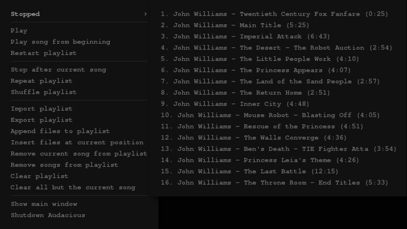

# Audacious control (alternative)



A menu to control Audacious - it uses audtool (builtin client for
audacious). The "Show/hide main window" feature **depends on *wmctrl***-
this is needed to detect if the window is shown or not and set the item
label/action accordingly. If you do not have *wmctrl* or have other
means of getting the information, adjust code accordingly or remove the
item. Most of the functions (add/remove/import/export etc.) depend on
one of gtkdialog/matedialog/zenity being installed.

This menu **consists of two files** - the actual menu (audmenu) and the
script (audctrl) that achieves most of the functionality. Both need to
be executable. The script needs to be in your PATH (or you would need to
specify the full path to it everywhere in the code of audmenu).

The audctrl script also provides a more extended "previous song"
feature - *audtool* does not jump from first to last song even when
repeat is on (it only allows jumping from last to first when selecting
"next song").

## audmenu

```perl
#!/usr/bin/perl
# A pipe menu for openbox to control Audacious.
# Depends on wmctrl and an additional script audctrl.
# All the functionality of audctrl can be incorporated into this script (as is done with the playlist submenu),
# but this way, it can be used independently of this menu in a complementary way to audtool.
# audctrl should be in your PATH
use Cwd 'abs_path';

use subs print_plst, separator, end_menu;
sub item ($$);
sub say { print @_, "\n"; }

# path to this script needed because it calls itself to create the playlist submenu
my $path = abs_path $0;

chomp (our $pid = `pidof audacious`);
our $status;
our $curr_song;
our $curr_song_lgth;
our $curr_song_elapsed;
our $curr_song_pos;
our $plst_lgth;

# print playback status
if ( $pid ) {
    chomp ($status = `audtool --playback-status`);
    $status =~ s/(\w)(\w*)/\U$1\L$2/;
    chomp ($curr_song = `audtool --current-song`);
    $curr_song = "" if $curr_song eq "No song playing.";
    chomp ($curr_song_lgth = `audtool --current-song-length`) if $curr_song;
    chomp ($curr_song_elapsed = `audtool --current-song-output-length`) if $curr_song;
    chomp ($curr_song_pos = `audtool --playlist-position`) if $curr_song;
    chomp ($plst_lgth = `audtool --playlist-length`);
} else {
    $status = 'Off';
}

# print playlist submenu and exit if arg 1 is pls
print_plst if "$ARGV[0]" eq 'pls';

# otherwise, start printing the main menu
say "<openbox_pipe_menu>";

# if audacious is not running, print "start" option and exit; else determine status and set playlist menu label
if ( $status eq 'Off' ) {
    item 'Start audacious', 'audacious';
    end_menu;
}

# print playback status
{
    my $title;
    if ( $status eq 'Stopped' ) {
	$title = $status . ( $curr_song ? " $curr_song_pos/$plst_lgth: $curr_song ($curr_song_lgth)" : "" );
    } else {
	$title = "$status $curr_song_pos/$plst_lgth: $curr_song ($curr_song_elapsed)";
    }

# unless playlist is empty, print it as menu, otherwise - just put a separator with the status
    if ( $plst_lgth == 0 ) {
	separator $title;
    } else {
	say "<menu id=\"pls\" label=\"$title\" execute=\"$path pls\" />";
	separator;
    }
}

# play/pause song
if ( $status eq 'Playing') {
    item 'Pause', 'audtool --playback-playpause';
} else {
    item 'Play', 'audtool --playback-playpause';
}

# stop playback
item 'Stop', 'audtool --playback-stop' unless $status eq 'Stopped';

# play song/playlist from the beginning
item 'Play song from beginning', 'audtool --playback-seek 0';
item 'Restart playlist', 'audtool --playlist-jump 1';

# play next/previous song; 'audctrl prev' accounts for the case where repeat is on and current song is number 1
unless ( $status eq 'Stopped' ) {
    item 'Next', 'audtool --playlist-advance';
    item 'Previous', 'audctrl prev';
}
separator;

# toggle "stop after current song"
if ( `audtool --playlist-stop-after-status` eq "off\n" ) {
    item 'Stop after current song', 'audtool --playlist-stop-after-toggle';
} else {
    item 'Continue after current song', 'audtool --playlist-stop-after-toggle';
}

# toggle "repeat playlist"
if ( `audtool --playlist-repeat-status` eq "off\n" ) {
    item 'Repeat playlist', 'audtool --playlist-repeat-toggle';
} else {
    item 'Do not repeat playlist', 'audtool --playlist-repeat-toggle';
}

# toggle "shuffle playlist"
if ( `audtool --playlist-shuffle-status` eq "off\n" ) {
    item 'Shuffle playlist', 'audtool --playlist-shuffle-toggle';
} else {
    item 'Do not shuffle playlist', 'audtool --playlist-shuffle-toggle';
}
separator;

# import/export playlist
item 'Import playlist', 'audctrl import';
item 'Export playlist', 'audctrl export';

# add files to playlist
item 'Append files to playlist', 'audctrl add';
item 'Insert files at current position', 'audctrl ins';

# remove songs from playlist
item 'Remove current song from playlist', "audtool --playlist-delete $curr_song_pos";
item 'Remove songs from playlist', 'audctrl del';

# clear playlist
item 'Clear playlist', 'audtool --playlist-clear';
item 'Clear all but the current song', 'audctrl clear';
separator;

# show hide main window
if ( `wmctrl -lp | tr -s ' ' | cut -d' ' -f3` =~ /^$pid$/m ) {
    item 'Hide main window', 'audtool --mainwin-show off';
} else {
    item 'Show main window', 'audtool --mainwin-show on';
}

# shutdown audacious
item 'Shutdown Audacious', 'audtool --shutdown';
end_menu;

##################################################################################################
########################################### SUBROUTINES ##########################################
##################################################################################################

# playlist submenu (called by passing a 'pls' argument to this script)
sub print_plst {
    say "<openbox_pipe_menu>";
    for my $song ( 1 .. $plst_lgth ) {
	chomp (my $title = `audtool --playlist-song $song`);
	chomp (my $lgth = `audtool --playlist-song-length $song`);

# replace some special characters by their html codes
	$title =~ s/&/&/g;
	$title =~ s/"/"/g;
	$title =~ s/\$/$/g;
	$title =~ s/</</g;
	$title =~ s/=/=/g;
	$title =~ s/>/>/g;
	$title =~ s/\\/\/g;
# replace the underscore with a double underscore in the label to prevent openbox from interpreting it as a keyboard accelerator
	$title =~ s/_/__/g;

	item "$song. $title ($lgth)", "audtool --playlist-jump $song";
    }
    end_menu;
}

# print a separator
sub separator {
    if ( @_ ) {
	my $label = shift;
	say "<separator label=\"$label\" />";
    } else {
	say "<separator />";
    }
    return 1;
}

# print an item
sub item ($$) {
    my $label = shift;
    my $cmd = shift;
    say "  <item label=\"$label\">";
    say "    <action name=\"Execute\">";
    say "      <execute>";
    say "        $cmd";
    say "      </execute>";
    say "    </action>";
    say "  </item>";
    return 1;
}

# end the main menu
sub end_menu {
    say "</openbox_pipe_menu>";
    exit 0;
}
```

## audctrl

```perl
#!/usr/bin/perl
# Additional functions to control Audacious. Needs matedialog, zenity or gtkdialog.

use File::Basename;
use File::Find;
use warnings;

sub add ($);
sub prev;
sub clear_others;
sub del;
sub import_pls;
sub export_pls;

sub get_playlist;
sub get_playlist_length;
sub get_playlist_position;
sub browse_dir;
sub get_files;
sub get_dirs;

sub get_installed_gtkdialog;
sub gtk_list ($);
sub gtk_list_gnome_mate;
sub gtk_list_gtkdialog;
sub gtk_savefile ($);
sub gtk_savefile_gnome_mate;
sub gtk_savefile_gtkdialog;
sub gtk_prompt ($);
sub gtk_prompt_gnome_mate;
sub gtk_prompt_gtkdialog;
sub gtk_error ($);
sub gtk_error_gnome_mate;
sub gtk_error_gtkdialog;

sub esc_chars ($);

our $DEBUG = 0; # INTERNAL

##################################################################################################
########################################## CONFIGURATION #########################################
##################################################################################################

# set default starting directory
our $base_dir = '/media/Music';
# true to show hidden files and directories
our $hidden = 0;
# colon separated regex pattern for files to include when browing for songs
# defaults to '\.mp3$:\.flac$:\.wav$:\.ogg$'
our $music_files = ;
# colon separated regex pattern for files to include when browing for playlists
# defaults to '\.m3u$:\.pls$'
our $pls_files = ;

##################################################################################################

#die "Provide exactly one argument!\n" unless @ARGV == 1;
prev if "$ARGV[0]" eq "prev";
clear_others if "$ARGV[0]" eq "clear";

# the rest of the functions require a gtkdialog tool
our $GTKDIALOG = get_installed_gtkdialog;

add 0 if "$ARGV[0]" eq "add";
add 1 if "$ARGV[0]" eq "ins";
del if "$ARGV[0]" eq "del";
import_pls if "$ARGV[0]" eq "import";
export_pls if "$ARGV[0]" eq "export";
die "Unsupported function $ARGV[0]\n";

##################################################################################################
########################################### SUBROUTINES ##########################################
##################################################################################################

##################################################################################################
# Jump to previous song - accounts for the case when repeat is on and the current song is number 1
sub prev {
    if ( `audtool --playlist-repeat-status` eq "on\n" && `audtool --playlist-position` == "1\n" ) {
	my $plst_lgth = get_playlist_length;
	system("audtool --playlist-jump $plst_lgth");
    } else {
	system("audtool --playlist-reverse");
    }
    exit 0;
}

##################################################################################################
# Remove all but the current song
sub clear_others {
    my $plst_lgth = get_playlist_length;
    if ( $plst_lgth > 1 ) {
	my $del = 1;
	my $curr_song = get_playlist_position;
	PLS: for my $song ( 1 .. $plst_lgth ) {
	    if ( $song == $curr_song ) {
		$del = 2;
		next PLS;
	    }
	    system("audtool --playlist-delete $del");
	}
    }
    exit 0;
}

# Remove songs at positions
sub del {
    my $playlist = get_playlist;
    my @selection = split /\|/, gtk_list {
	title => 'Remove songs from playlist',
	entries => $playlist
    };

    print "@selection\n" if $DEBUG;
    $_ =~ s/^(\d+).*/$1/ for @selection;
    my $iter = 0;
    for (sort { $a <=> $b } @selection) {
	my $del = $_ - $iter;
	system ("audtool --playlist-delete $del");
	$iter++;
    }
    exit 0;
}

##################################################################################################
# Add songs to specified positions or the end of the playlist
sub add ($) {
# colon separated regex pattern for files to include (if not empty, it shows only files matching the pattern
# and ignores the pattern for exclusion)
    local $include_only = $music_files || '\.mp3$:\.flac$:\.wav$:\.ogg$';
# colon separated regex pattern for files to exclude (ignored if include_only is not null)
    local $exclude = ;
    my $insert = shift;
    my $selection = browse_dir ('Add files');
    for ( @$selection ) {
	$_ = esc_chars $_;
	if ( $insert ) {
	    chomp (my $position = `audtool --playlist-position`);
	    $position = 1 if $position == 0;
	    system ("audtool --playlist-insurl $_ $position");
	} else {
	    system ("audtool --playlist-addurl $_");
	}
    }
    exit 0;
}

##################################################################################################
# Import playlist from a .m3u file
sub import_pls {
# colon separated regex pattern for files to include (if not empty, it shows only files matching the pattern
# and ignores the pattern for exclusion)
    local $include_only = $pls_files || '\.m3u$:\.pls$';
# colon separated regex pattern for files to exclude (ignored if include_only is not null)
    local $exclude = ;
    my $selection = browse_dir;

    if ( &get_playlist_length ) {
	my $clear = gtk_prompt {
	    title => 'Import playlist',
	    prompt => 'Clear current playlist before import?'
	};
	system ("audtool --playlist-clear") if $clear;
    }

    for ( @$selection ) {
	$_ = esc_chars $_;
	if ( $insert ) {
	    chomp (my $position = `audtool --playlist-position`);
	    $position = 1 if $position == 0;
	    system ("audtool --playlist-insurl $_ $position");
	} else {
	    system ("audtool --playlist-addurl $_");
	}
    }
    exit 0;
}

##################################################################################################
# Export playlist to a .m3u file
sub export_pls {
    my $file = gtk_savefile {
	title => 'Export playlist',
	filters => '*.mp3:*.pls'
    };

    open PLS, ">$file" or gtk_error "Can't write to $file!";
    for my $song ( 1 .. &get_playlist_length ) {
	my $file = `audtool --playlist-song-filename $song`;
	print PLS $file;
    }
    close PLS;
    exit 0;
}

##################################################################################################
##################################### ADDITIONAL SUBROUTINES #####################################
##################################################################################################

##################################################################################################
# Get Audacious' playlist
sub get_playlist {
    chomp (my $playlist = `audtool --playlist-display | grep '|'`);
    $playlist =~ s/\ {2,}|\ *\|//gm;
    $playlist =~ s/^([^ ]+)/$1./gm;
    $playlist =~ s/\ ([^ ]+)$/\ ($1)/gm;
    return [ split /\n/, $playlist ];
}
# length
sub get_playlist_length {
    chomp (my $plst_lgth = `audtool --playlist-length`);
    return $plst_lgth;
}
# position
sub get_playlist_position {
    chomp (my $plst_pos = `audtool --playlist-position`);
    return $plst_pos;
}

##################################################################################################
# Browse the music directory
sub browse_dir (;$) {
    while ( 1 ) {
	my $title = shift;
	local @contents;
	$base_dir .= '/' unless $base_dir =~ m:/$:;
	print "recursing into $base_dir\n" if $DEBUG;
	find ( { preprocess => \&get_dirs, wanted => \&get_files }, "$base_dir");
	print "contents are: @contents\n" if $DEBUG;
#	$_ = basename $_ for @contents;
	# unless we're in the root directory, add '..' to the entries and a trailing / to $base_dir
	unless ( $base_dir eq '/' ) {
	    unshift @contents, '..';
	}
	my @selection = split /\|/, gtk_list {
	    title => $title,
	    label => $base_dir,
	    entries => \@contents
	};
	$_ = $base_dir . $_ for @selection;

	if ( @selection > 1 ) {
	    @selection = grep { $_ !~ m:/\.\.$: } @selection;
	    print "multiple files: @selection\n" if $DEBUG;
	    return \@selection;
	}

	unless ( -d $selection[0] || $selection[0] =~ m:/\.\.$: ) {
	    print "not a dir: @selection\n" if $DEBUG;
	    return \@selection;
	}

	print "dir: @selection\n" if $DEBUG;
	$base_dir = $selection[0];
	$base_dir =~ s:/?[^/]+/\.\.$::;
	print "base_dir: $base_dir\n" if $DEBUG;
    }
}

##################################################################################################
# Escape some special characters in bash
sub esc_chars ($) {
    my $str = shift;
    $str =~ s/(\ |'|"|`|!|\^|&|\$|\*|>|<|=|\\|\(|\)|\[|\]|\{|\})/\\$1/g;
    return $str;
}

##################################################################################################
########################################## FILE HELPERS ##########################################
##################################################################################################

##################################################################################################
# Filter out directories
sub get_dirs {
    print ("args for preproc: " . ( scalar @_ ) . " @_\n\n") if $DEBUG;
    my @dirs = sort grep { -d && ( !$hidden ? $_ !~ /^\./ : 1 ) && $_ !~ /^\.?\.$/ } @_;
    my @files = sort grep { ( not -d ) && ( !$hidden ? $_ !~ /^\./ : 1 ) } @_;
    if ( $include_only ) {
	my $iter = 0;
      FILE: while ( $files[$iter] ) {
	  for my $pattern ( split /:/, $include_only ) {
	      if ( $files[$iter] =~ m/$pattern/ ) {
		  $iter++;
		  next FILE;
	      }
	  }
	  splice @files, $iter, 1;
      }
    } else {
	my $iter = 0;
      FILE: while ( $files[$iter] ) {
	  for my $pattern ( split /:/, $exclude ) {
	      if ( $files[$iter] =~ m/$pattern/ ) {
		  splice @files, $iter, 1;
		  next FILE;
	      }
	  }
	  $iter++;
      }
    }
    print (( scalar @dirs ) . " @dirs\n " . ( scalar @files ) . " @files\n\n") if $DEBUG;
    push @contents, @dirs;
    return @files;
}

##################################################################################################
# Filter files
sub get_files {
    print ("args for proc: " . ( scalar @_ ) . "\n@_\n") if $DEBUG;
    return if $_ eq '.';
    push @contents, $_;
}

##################################################################################################
########################################### GTK HELPERS ##########################################
##################################################################################################

##################################################################################################
# Determine which gtkdialog tool we'll use
sub get_installed_gtkdialog {
    my @choices = ('gtkdialog', 'matedialog', 'zenity');
    for ( @choices ) {
	return $_ if system ("which $_") == 0;
    }
    die "Make sure that one of '" . ( join "', '", @choices) ."' is installed and in your PATH\n";
}

##################################################################################################
# Create a gtk list
sub gtk_list ($) {
    local $title = ${$_[0]}{title};
    local $label = ${$_[0]}{label};
    local @entries = @{${$_[0]}{entries}};
    print "\ntitle: $title\nlabel: $label\nentries:@entries\n\n" if $DEBUG;
    return gtk_list_gtkdialog if $GTKDIALOG eq 'gtkdialog';
    return gtk_list_gnome_mate if $GTKDIALOG =~ m/matedialog|zenity/;
}
# using matedialog/zenity
sub gtk_list_gnome_mate {
    my @entries = map { esc_chars $_ } @entries;
    chomp (my $selection = `$GTKDIALOG --width=500 --height=600 --title="$title" --list --text="$label" --column= --separator='|' --multiple --hide-header @entries 2>/dev/null`);

    die unless $selection;
    return $selection;
}
# using gtkdialog
sub gtk_list_gtkdialog {
    my @entries = map { $_ =~ s/'/'"'"'/gr } @entries;
    my $MAIN_DIALOG = '
<window title="' . $title . '" resizable="true" width-request="500" height-request="600">
<vbox>

  <hbox><tree selection_mode="multiple">
    <width>500</width><height>550</height>
    <variable>SELECTION</variable>
    <label>' . ( $label || '""' ) . '</label>
    ';

    $MAIN_DIALOG .= "<item>$_</item>\n" for @entries;

    $MAIN_DIALOG .= '    <action type="exit">OK</action>
  </tree></hbox>

  <hbox>
    <button cancel></button>
    <button ok><action type="exit">OK</action></button>
  </hbox>

</vbox>
</window>
';

    my $selection = `gtkdialog --stdin --center <<<\'$MAIN_DIALOG\' 2>/dev/null`;
    my $exit_status = ( $selection =~ m/EXIT="([^"]+)"/s )[0];
    $selection = ( $selection =~ m/SELECTION="([^"]+)"/s )[0];

    die unless $exit_status eq 'OK';
    $selection = join '|', (split /\n/, $selection);
    return $selection;
}

##################################################################################################
# Create a gtk 'save file' entry
sub gtk_savefile ($) {
    local $title = ${$_[0]}{title};
    local $label = ${$_[0]}{label};
    local $filters = ${$_[0]}{filters};
    local $base_dir = ${$_[0]}{base_dir} || $base_dir;
    print "\ntitle: $title\nlabel: $label\nfilters:$filters\nbase_dir: $base_dir\n\n" if $DEBUG;
    return gtk_savefile_gtkdialog if $GTKDIALOG eq 'gtkdialog';
    return gtk_savefile_gnome_mate if $GTKDIALOG =~ m/matedialog|zenity/;
}
#using matedialog/zenity
sub gtk_savefile_gnome_mate {
    my $cmd;
    if ( $base_dir ) {
	$cmd = "$GTKDIALOG " . ( $label ?  : '--width="300" ' ) . "--title=\"$title\" --file-selection --filename=\"$base_dir\" ";
	$cmd .= "--file-filter='$_' " for ( split /:/, $filters );
	$cmd .= '--file-filter="*" --save --confirm-overwrite --separator="|"';

    } else {
	$cmd = "$GTKDIALOG " . ( $label ?  : '--width="300" ' ) . "--entry --title=\"$title\" --text=\"$label\"";
	chomp ($selection = `$GTKDIALOG  2>/dev/null`);
    }
    chomp (my $selection = `$cmd 2>/dev/null`);

    die unless $selection;
    return $selection;
}
#using gtkdialog
sub gtk_savefile_gtkdialog {
    my $MAIN_DIALOG = '

<window title="' . $title . '" resizable="false" width-request="' . ( $label ? (length $label) * 8 : 300 ) . '" height-request="' . ( $label ? 100 : 70 ) . '">
<vbox>
';

    if ( $label ) {
	$MAIN_DIALOG .='
<frame ' . $label . '>';
    }

    $MAIN_DIALOG .= '
  <hbox>
    <entry editable="true" accept="filename">
      <variable>OUTPUT</variable>
      <action signal="activate" type="exit">OK</action>
    </entry>';

if ( $base_dir ) {
    $MAIN_DIALOG .= '
    <button>
      <label>..</label>
      <visible>enabled</visible>
      <action type="fileselect">OUTPUT</action>
    </button>';
}
    $MAIN_DIALOG .= '
  </hbox>
';

    $MAIN_DIALOG .= '</frame>' if $label;
    $MAIN_DIALOG .= '

  <hbox>
    <button cancel></button>
    <button ok><action type="exit">OK</action></button>
  </hbox>

</vbox>
</window>
';

    my $result = `gtkdialog --stdin --center <<<\'$MAIN_DIALOG\' 2>/dev/null`;
    my $output = ( $result =~ m/OUTPUT="([^"]*)"/s )[0];
    my $exit_status = ( $result =~ m/EXIT="([^"]+)"/s )[0];

    die unless $exit_status eq 'OK';
    return $output;
}

##################################################################################################
# Create a gtk prompt
sub gtk_prompt ($) {
    local $title = ${$_[0]}{title};
    local $label = ${$_[0]}{prompt};
    print "\ntitle: $title\nlabel: $label\n\n" if $DEBUG;
    return gtk_prompt_gtkdialog if $GTKDIALOG eq 'gtkdialog';
    return gtk_prompt_gnome_mate if $GTKDIALOG =~ m/matedialog|zenity/;
}
#using matedialog/zenity
sub gtk_prompt_gnome_mate {
    system("$GTKDIALOG --question --title=\"$title\" --text=\"$label\" 2>/dev/null");
    return $?;
}
#using gtkdialog
sub gtk_prompt_gtkdialog {
    my $MAIN_DIALOG = '

<window title="' . $title . '" resizable="false" width-request="300" height-request="100">
<vbox>

  <hbox space-expand="true">
    <text><label>' . ( $label || '""' ) . '</label></text>
  </hbox>

  <hbox>
    <button cancel></button>
    <button yes><action type="exit">YES</action></button>
    <button no><action type="exit">NO</action></button>
  </hbox>

</vbox>
</window>
';

    my $result = `gtkdialog --stdin --center <<<\'$MAIN_DIALOG\' 2>/dev/null`;
    my $exit_status = ( $result =~ m/EXIT="([^"]+)"/s )[0];
    return if $exit_status eq 'NO';
    return 1 if $exit_status eq 'YES';
    die;
}

##################################################################################################
# Show an error dialog and exit
sub gtk_error ($) {
    local $error = shift;
    gtk_error_gtkdialog if $GTKDIALOG eq 'gtkdialog';
    gtk_error_gnome_mate if $GTKDIALOG =~ m/matedialog|zenity/;
}
# using matedialog/zenity
sub gtk_error_gnome_mate {
    system ("$GTKDIALOG --error --title=\"Error\" --text=\"$error\" 2>/dev/null");
    die;
}
# using gtkdialog
sub gtk_error_gtkdialog {
    my $MAIN_DIALOG = '

<window title="Error" resizable="false" width-request="300" height-request="150">
<vbox>

  <hbox space-expand="true">
      <text><label>' . $error . '</label></text>
  </hbox>

  <hbox>
    <button ok></button>
  </hbox>

</vbox>
</window>
';
    system("gtkdialog --stdin --center <<<\'$MAIN_DIALOG\' 2>/dev/null");
    die;
}
```
