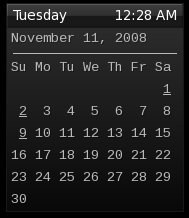

# Date menu

 Simply save this code into a new file
somewhere in your home directory and make a link to it as a dynamic menu.
I designed it as a standalone menu so you can hit some key combination and it appears.

```py
#!/usr/bin/env python

import os
import re
import string
import sys
from os.path import isdir

# ---------------------------------- About ----------------------------------- #
# This file inserts a wallpaper pipe menu into Openbox which uses feh          #
# in order to set the wallpaper from a chosen directory.                       #
#                         #
# Authors: dav1d(main author) and Pwnz3r(hacker and redistributor)         #
#                         #
# Dav1d's site: http://southwing.homeip.net/~david/             #
# Pwnz3r's site: http://pstudios.ath.cx/               #
#                         #
# ------------------------------ Setting it up ------------------------------- #
# feh automatically inserts the full command string used to set the wallpaper  #
# into ~/.fehbg. In order to set the wallpaper back at the next start of       #
# Openbox, just add the following to ~/.xinitrc.                               #
#                         #
# eval `cat ~/.fehbg`                     #
# ---------------------------------------------------------------------------- #

# types of files accepted (list, seperated by a |)
filetypes = "jpg|png|gif"
# directory where wallpapers are stored (must be long: no ~ symbol allowed)
directory = sys.argv[1]
# program to set wallpaper defined in the command string
program = "feh --bg-scale"

def genmenu(start, directory):
  # get a directory list
  dirlist = os.listdir(directory)
  for d in dirlist:
    # set di to overall directory
    di = directory + "/" + d
    # if we get a dir, generate a menu
    if isdir(di) and ".thumbnails" not in di:
      print ""
      print "  <menu id=\"" + di + "\" label=\"" + d + "\" >"
      genmenu(start, di)
      print "  </menu>"
    # if we get a file, check if it is a valid type
    else:
      if re.search(filetypes, string.lower(di)) > 0:
        # make fi variable just filename, without extension
        fi = string.replace(string.replace(di, directory, ""), "/", "")
        fi = fi[:string.rfind(fi, ".")]
        # if so, add it to the pipe menu
        print "  <item label=\"" + fi + "\">"
        # execute line to set wallpaper
        print "    <action name=\"Execute\"><execute>" + program + " \"" + di + "\"</execute></action>"
        # if we want to update config file, do so
        print "  </item>"

def main():
  # start menu
  print "<?xml version=\"1.0\" encoding=\"UTF-8\"?>"
  print "<openbox_pipe_menu>"

  # set the original start directory
  start = directory
  # generate menu
  genmenu(start, directory)

  # end menu
  print "</openbox_pipe_menu>"

# run the main() function
if __name__ == "__main__":
  main()
```
