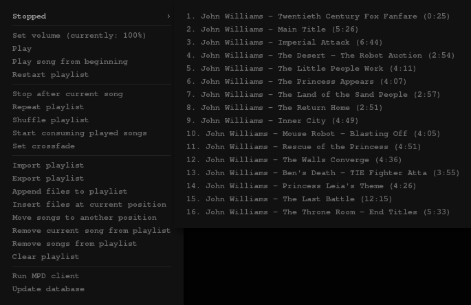

# mpdcontrol



A menu to control MPD - it uses the mpc client. This menu **consists of two files** -
the actual menu (mpdmenu) and the script (mpdctrl) that achieves most of the
functionality. Both need to be executable. Most of the functions
(add/remove/import/export etc.) depend on one of `gtkdialog`/`matedialog`/`zenity`
being installed. The script needs to be in your PATH
(or you would need to specify the full path to it everywhere in the code of `mpdmenu`).

## mpdmenu

```perl
#!/usr/bin/perl
# A pipe menu for openbox to control MPD.
# Depends on mpc and an additional script mpdctrl.
# All the functionality of mpdctrl can be incorporated into this script (as is done with the playlist submenu),
# but this way, it can be used independently of this menu in a complementary way to mpc.
# mpdctrl should be in your PATH
#
# to do:
# sorting of playlist
use Cwd 'abs_path';
use warnings;
use strict;

sub print_plst;
sub separator;
sub item;
sub end_menu;
sub fix_html (\$);
sub say { print @_, "\n"; }

# path to this script needed because it calls itself to create the playlist submenu
my $path = abs_path $0;

##################################################################################################
########################################## CONFIGURATION #########################################
##################################################################################################

my $mpd_client = 'urxvtc -geometry 225x80 -e ncmpcpp';
my $start_cmd = ;
my $stop_cmd = ;

##################################################################################################

chomp (my $pid = `pidof mpd`);
my $status = ;
my $curr_song = ;
my $curr_song_elapsed = ;
my $curr_song_pos = ;
my $repeat = ;
my $random = ;
my $single = ;
my $consume = ;
my $crossfade = ;
my $volume = ;

# if MPD is running, get info on playlist
if ( $pid ) {
  my $song_format = '[[%artist% - |%composer% - |%performer% - |%album% - ][%title%]|[%file%]]';
  chomp (my @stats = split /\n/, `mpc -f '$song_format'`);
  if ( $stats[1] && @stats > 1 ) {
    $status = $stats[1] =~ s/\[(\w)(\w*)\].*/\U$1\L$2/r;
    $curr_song = $stats[0];
    ($curr_song_pos, $curr_song_elapsed) = (split /\s+/, $stats[1])[1,2];
    $curr_song_pos =~ s/^#//;
  } else {
    $status = 'Stopped';
  }
  ($stats[2] || $stats[0]) =~ m/repeat:\s*(?<repeat>[a-z]+)\s+
			      random:\s*(?<random>[a-z]+)\s+
			    single:\s*(?<single>[a-z]+)\s+
			  consume:\s*(?<consume>[a-z]+)/x;
  ($repeat, $random, $single, $consume) = ($+{repeat}, $+{random}, $+{single}, $+{consume});
  chomp ($crossfade = `mpc crossfade`);
  $crossfade =~ s/crossfade:\s*//;
  chomp ($volume = `mpc volume`);
  $volume =~ s/volume:\s*//;
} else {
  $status = 'Off';
}

# print playlist submenu and exit if arg 1 is pls
print_plst if @ARGV && "$ARGV[0]" eq 'pls';

# otherwise, start printing the main menu
say "<openbox_pipe_menu>";

# if MPD is not running, print "start" option and exit; else determine status and set playlist menu label
if ( $status eq 'Off' ) {
  unless ( $start_cmd ) {
    separator "MPD is not running!";
    end_menu;
  }
  item 'Run MPD', $start_cmd;
  end_menu;
}

# print playback status
{
  fix_html $curr_song;
  my $title = $status . ( $status eq 'Stopped' ?  : " $curr_song_pos: $curr_song ($curr_song_elapsed)" );

  # unless playlist is empty, print it as menu, otherwise - just put a separator with the status
  if ( `mpc playlist` ) {
    say "<menu id=\"pls\" label=\"$title\" execute=\"$path pls\" />";
    separator;
  } else {
    separator $title;
  }
}

# set volume
item "Set volume (currently: $volume)", "mpdctrl vol";

# play/pause song
if ( $status eq 'Playing') {
  item 'Pause', 'mpc toggle';
} else {
  item 'Play', 'mpc toggle';
}

# stop playback
item 'Stop', 'mpc stop' unless $status eq 'Stopped';

# play song/playlist from the beginning
item 'Play song from beginning', 'mpc seek 0';
item 'Restart playlist', 'mpc play 1';

# play next/previous song
unless ( $status eq 'Stopped' ) {
  item 'Next', 'mpc next';
  item 'Previous', 'mpc prev';
}
separator;

# toggle "single mode"
if ( $single eq 'off' ) {
  item 'Stop after current song', 'mpc single';
} else {
  item 'Continue after current song', 'mpc single';
}

# toggle "repeat mode"
if ( $repeat eq 'off' ) {
  item 'Repeat playlist', 'mpc repeat';
} else {
  item 'Do not repeat playlist', 'mpc repeat';
}

# toggle "random mode"
if (  $random eq 'off' ) {
  item 'Shuffle playlist', 'mpc random';
} else {
  item 'Do not shuffle playlist', 'mpc random';
}

# toggle "consume mode"
if (  $consume eq 'off' ) {
  item 'Start consuming played songs', 'mpc consume';
} else {
  item 'Stop consuming played songs', 'mpc consume';
}

# set crossfade
item "Disable crossfade (currently: $crossfade)", 'mpc crossfade 0' unless $crossfade == 0;
item 'Set crossfade', 'mpdctrl cross';
separator;

# import/export playlist
item 'Import playlist', 'mpdctrl import';
item 'Export playlist', 'mpdctrl export';

# add files to playlist
item 'Append files to playlist', 'mpdctrl add';
item 'Insert files at current position', 'mpdctrl ins';

# move songs
item 'Move songs to another position', 'mpdctrl mv';

# remove songs from playlist
if ( $status eq 'Stopped' ) {
  item 'Remove current song from playlist', 'mpc del 1';
} else {
  item 'Remove current song from playlist', 'mpc del 0';
}
item 'Remove songs from playlist', 'mpdctrl del';

# clear playlist
item 'Clear playlist', 'mpc clear';
item 'Clear all but the current song', 'mpc crop' unless $status eq 'Stopped';
separator;

# run client
item 'Run MPD client', $mpd_client if $mpd_client;

# update database
item 'Update database', 'mpc update';

# shutdown MPD
item 'Kill MPD', $stop_cmd if $stop_cmd;

end_menu;

##################################################################################################
########################################### SUBROUTINES ##########################################
##################################################################################################

# playlist submenu (called by passing a 'pls' argument to this script)
sub print_plst {
  my $song_format = '[%position%. ][[%artist% - |%composer% - ' .
    '|%performer% - |%album% - ][%title%]|[%file%]][ (%time%)]';
  chomp (my @pls = split /\n/, `mpc -f '$song_format' playlist`);
  say "<openbox_pipe_menu>";
  for ( @pls ) {
    fix_html $_;
    item $_, 'mpc play ' . $_ =~ s/^(\d+).*/$1/r;
  }
  end_menu;
}

# print a separator
sub separator {
  if ( @_ ) {
    my $label = shift || "";
    say "<separator label=\"$label\" />";
  } else {
    say "<separator />";
  }
}

# print an item
sub item {
  my $label = shift || "";
  my $cmd = shift || ":";
  say "  <item label=\"$label\">";
  say "    <action name=\"Execute\">";
  say "      <execute>";
  say "        $cmd";
  say "      </execute>";
  say "    </action>";
  say "  </item>";
}

# end the main menu
sub end_menu {
  say "</openbox_pipe_menu>";
  exit 0;
}

# escape some special characters
sub fix_html (\$) {
  my $str = shift or die;
  # replace some special characters by their html codes
  $$str =~ s/&/&/g;
  $$str =~ s/"/"/g;
  $$str =~ s/\$/$/g;
  $$str =~ s/</</g;
  $$str =~ s/=/=/g;
  $$str =~ s/>/>/g;
  $$str =~ s/\\/\/g;
  # replace the underscore with a double underscore in the label to prevent openbox from interpreting it as a keyboard accelerator
  $$str =~ s/_/__/g;
}
```

## mpdctrl

```perl
#!/usr/bin/perl
# Additional functions to control MPD. Needs Perl::Capture::Tiny, mpc and one of gtkdialog, matedialog, zenity.

use Capture::Tiny ':all';
use File::Basename;
use File::Which;
# use IO::CaptureOutput qw/capture_exec/;
# my $rc = eval
# {
#    require IO::CaptureOutput;
#    IO::CaptureOutput->import(capture_exec);
#    return 1;
# };
# print "Loaded." if $rc;
# exit 0;
use warnings;

sub add_files ($);
sub mv_files;
sub del_files;
sub set_crossfade;
sub set_volume;
sub import_pls;
sub export_pls;

sub get_mpd_dirs;
sub browse_music_dir (;$);
sub ls_dir ($);

sub get_installed_gtkdialog;
sub gtk_list ($);
sub gtk_list_gnome_mate;
sub gtk_list_gtkdialog;
sub gtk_savefile ($);
sub gtk_savefile_gnome_mate;
sub gtk_savefile_gtkdialog;
sub gtk_spinbutton ($);
sub gtk_dropdown_gnome_mate;
sub gtk_spinbutton_gtkdialog;
sub gtk_prompt ($);
sub gtk_prompt_gnome_mate;
sub gtk_prompt_gtkdialog;
sub gtk_scale ($);
sub gtk_scale_gnome_mate;
sub gtk_error ($);
sub gtk_error_gnome_mate;
sub gtk_error_gtkdialog;

sub get_playlist (;$);
sub export_pls_ext;
sub esc_chars ($);

our $DEBUG = 0; # INTERNAL

die "Provide exactly one argument!\n" unless @ARGV == 1;
die "Please install mpc" unless which('mpc');
# the functions require a gtkdialog tool
our $GTKDIALOG = get_installed_gtkdialog;

add_files 0 if "$ARGV[0]" eq "add";
add_files 1 if "$ARGV[0]" eq "ins";
mv_files if "$ARGV[0]" eq "mv";
del_files if "$ARGV[0]" eq "del";
set_crossfade if "$ARGV[0]" eq "cross";
set_volume if "$ARGV[0]" eq "vol";
import_pls if "$ARGV[0]" eq "import";
export_pls if "$ARGV[0]" eq "export";
die "Unsupported function $ARGV[0]\n";

##################################################################################################
######################################## MAIN SUBROUTINES ########################################
##################################################################################################

##################################################################################################
# Add songs to specified positions or the end of the playlist
sub add_files ($) {
    my $insert = shift;
    my $selection = browse_music_dir ('Add files');
    for ( @$selection ) {
	$_ = esc_chars $_;
	if ( $insert ) {
	    system ("mpc insert $_");
	} else {
	    system ("mpc add $_");
	}
    }
    exit 0;
}

##################################################################################################
# Move songs to a position
sub mv_files {
    my $playlist = get_playlist;
    my @selection = split /\|/, gtk_list {
	title => 'Select songs to move',
	entries => $playlist
    };

    $_ =~ s/^(\d+).*/$1/ for @selection;
    print "@selection\n" if $DEBUG;
    my $maxpos = @$playlist + 1;
    my $target = 0;
    $target = gtk_spinbutton {
	title => 'Move songs',
	label => "Enter new position [1-$maxpos]:",
	min => 1,
	max => $maxpos
    } while ( $target < 1 || $target > $maxpos );

    my $iter = 0;
    $target--;
    @selection = sort { $a <=> $b } @selection;
    for ( 0 .. $#selection ) {
	if ( $selection[$_] >= $target ) {
	    $target +=  $_;
	    last;
	}
    }
    for ( @selection ) {
	if ( $_ <= $target ) {
	    $_ -= $iter;
	} else {
	    $target++;
	}
	$iter++;
	print "$_, $target\n" if $DEBUG;
	system ("mpc mv $_ $target");
    }
    exit 0;
}

##################################################################################################
# Remove songs at positions
sub del_files {
    my $playlist = get_playlist;
    my @selection = split /\|/, gtk_list {
	title => 'Remove songs from playlist',
	entries => $playlist
    };

    print "@selection\n" if $DEBUG;
    $_ =~ s/^(\d+).*/$1/ for @selection;
    my $iter = 0;
    for (sort { $a <=> $b } @selection) {
	my $del = $_ - $iter;
	system ("mpc del $del");
	$iter++;
    }
    exit 0;
}

##################################################################################################
# Set crossfade length
sub set_crossfade {
    my $length;
    $length = gtk_spinbutton {
	title => 'Set crossfade',
	label => 'Enter number of seconds to fade:',
	min => 0,
	max => 120
    };
    system ("mpc crossfade $length");
    exit 0;
}

##################################################################################################
# Set volume
sub set_volume {
    chomp (my $volume = `mpc volume`);
    $volume =~ s/volume:\s*|%//g;

    $volume = gtk_scale {
	title => 'Set volume',
	label => 'Set MPD mixer volume in %:',
	min => 0,
	max => 100,
	default => $volume
    };
    system ("mpc volume $volume");
    exit 0;
}

##################################################################################################
# Import playlist from a .m3u file
sub import_pls {
    chomp (my $playlists = `mpc lsplaylists`);
    my @selection = split /\|/, gtk_list {
	title => 'Import playlist',
	entries => [ split /\n/, $playlists ]
    };

    if ( &get_playlist_length ) {
	my $clear = gtk_prompt {
	    title => 'Import playlist',
	    prompt => 'Clear current playlist before import?'
	};
	system ("mpc clear") if $clear;
    }

    system ("mpc load $_") for @selection;
    exit 0;
}

##################################################################################################
# Export playlist to a .m3u file
sub export_pls {
    exit 0 if export_pls_ext;

    my $file = gtk_savefile {
	title => 'Export playlist',
	label => 'Enter new name for .m3u playlist (without extension):'
    };
    $file = esc_chars $file;
    system ("mpc save $file");
    gtk_error "Cannot save file, check playlist_directory permissions or whether file exists!" unless $? == 0;
    exit 0;
}

##################################################################################################
########################################## FILE HELPERS ##########################################
##################################################################################################

##################################################################################################
# Get MPD's music_dir and playlist_dir
sub get_mpd_dirs {
    my @args = split /\s+/, `ps -o args= -C mpd`;
    my $iter = 0;
    while ( $args[$iter] ) {
	# remove options from mpd's command line
	if ( $args[$iter] =~ m/^--/ ) {
	    splice @args, $iter ;
	} else {
	    $iter++;
	}
    }
    # if specified, config file is the second (and last element in the mpd's command line)
    my $config_file = $args[1];
    # if not specified, try to guess the config file
    $config_file = ( "$ENV{XDG_CONFIG_HOME}" || "$ENV{HOME}/.config") . "/mpd/mpd.conf" unless -f $config_file;
    $config_file = "$ENV{HOME}/.mpdconf" unless -f $config_file;
    $config_file = "/etc/mpd.conf" unless -f $config_file;
#    gtk_error "Cannot find MPD's configuration file!"
    return unless -f $config_file;
    open CONF, "$config_file" or return;
#    gtk_error "Cannot read '$config_file'!"
    my $music_dir;
    my $pls_dir;
    while ( <CONF> ) {
	if ( $_ =~ m/^\s* music_directory \s+ (?| \" ( [^\"]+ ) | ( [^ ]+ ) )/x ) {
	    $music_dir = $1;
	} elsif ( $_ =~ m/^\s* playlist_directory \s+ (?| \" ( [^\"]+ ) | ( [^ ]+ ) )/x ) {
	    $pls_dir = $1;
	}
    }
    close CONF;
    return [ $music_dir, $pls_dir ] if $music_dir or $pls_dir;
    return;
}

##################################################################################################
# Browse the music directory
sub browse_music_dir (;$) {
    my $title = shift;
    my $location = ;
    my $contents;
    while ( $contents = ls_dir $location ) {
	print "ls_dir returned @$contents\n" if $DEBUG;
	$_ = basename $_ for @$contents;
	# unless we're in the root directory, add '..' to the entries and a trailing / to $location
	if ( $location ) {
	    unshift @$contents, '..';
	    $location .= '/';
	}
	my @selection = split /\|/, gtk_list {
	    title => $title,
	    label => ( $location || '/' ),
	    entries => $contents
	};
	$_ = $location . $_ for @selection;

	if ( @selection > 1 ) {
	    @selection = grep { $_ !~ m:/\.\.$: } @selection;
	    return \@selection;
	}

	$location = $selection[0];
	$location =~ s:/?[^/]+/\.\.$::;
	print "location: $location\n" if $DEBUG;
    }
    print "final: $location\n" if $DEBUG;
    return [ $location ];
}

##################################################################################################
# Get files/dirs/playlists in a directory
sub ls_dir ($) {
    my $dir = shift;
    print "dir: $dir\n" if $DEBUG;
    my ($stdout, $exit_code) = capture_stdout { system ("mpc ls '$dir'"); };
#    my ($stdout, $stderr, $success, $exit_code) = capture_exec( mpc ls "$dir" );
    chomp $stdout;
    print "stdout: $stdout\n" if $DEBUG;
    # continue only if $dir was actually a directory
    return unless $exit_code == 0 && $stdout ne $dir;
    my @contents = sort split /\n/, $stdout;
    print "contents: @contents\n" if $DEBUG;
    # remove playlists from list
    my $iter = 0;
    while ( $contents[$iter] ) {
	my $file = $contents[$iter];
	$file = esc_chars $file;
	($stdout, $exit_code) = capture_stdout { system ("mpc ls $file"); };
	if ( $exit_code == 0 ) {
	    $iter++;
	} else {
	    splice @contents, $iter, 1;
	}
    }
    return \@contents;
}

##################################################################################################
########################################### GTK HELPERS ##########################################
##################################################################################################

##################################################################################################
# Determine which gtkdialog tool we'll use
sub get_installed_gtkdialog {
    my @choices = ('gtkdialog', 'matedialog', 'zenity');
    for ( @choices ) {
	return $_ if which("$_");
    }
    die "Make sure that one of '" . ( join "', '", @choices) ."' is installed and in your PATH\n";
}

##################################################################################################
# Create a gtk list
sub gtk_list ($) {
    local $title = ${$_[0]}{title};
    local $label = ${$_[0]}{label};
    local @entries = @{${$_[0]}{entries}};
    print "\ntitle: $title\nlabel: $label\nentries:@entries\n\n" if $DEBUG;
    return gtk_list_gtkdialog if $GTKDIALOG eq 'gtkdialog';
    return gtk_list_gnome_mate if $GTKDIALOG =~ m/matedialog|zenity/;
}
# using matedialog/zenity
sub gtk_list_gnome_mate {
    my @entries = map { esc_chars $_ } @entries;
    chomp (my $selection = `$GTKDIALOG --width=500 --height=600 --title="$title" --list --text="$label" --column= --separator='|' --multiple --hide-header @entries 2>/dev/null`);

    die unless $selection;
    return $selection;
}
# using gtkdialog
sub gtk_list_gtkdialog {
    my @entries = map { $_ =~ s/'/'"'"'/gr } @entries;
    my $MAIN_DIALOG = '
<window title="' . $title . '" resizable="true" width-request="500" height-request="600">
<vbox>

  <hbox><tree selection_mode="multiple">
    <width>500</width><height>550</height>
    <variable>SELECTION</variable>
    <label>' . ( $label || '""' ) . '</label>
    ';

    $MAIN_DIALOG .= "<item>$_</item>\n" for @entries;

    $MAIN_DIALOG .= '    <action type="exit">OK</action>
  </tree></hbox>

  <hbox>
    <button cancel></button>
    <button ok><action type="exit">OK</action></button>
  </hbox>

</vbox>
</window>
';

    my $selection = `gtkdialog --stdin --center <<<\'$MAIN_DIALOG\' 2>/dev/null`;
    my $exit_status = ( $selection =~ m/EXIT="([^"]+)"/s )[0];
    $selection = ( $selection =~ m/SELECTION="([^"]+)"/s )[0];

    die unless $exit_status eq 'OK';
    $selection = join '|', (split /\n/, $selection);
    return $selection;
}

##################################################################################################
# Create a gtk 'save file' entry
sub gtk_savefile ($) {
    local $title = ${$_[0]}{title};
    local $label = ${$_[0]}{label};
    local $filters = ${$_[0]}{filters};
    local $base_dir = ${$_[0]}{base_dir};
    print "\ntitle: $title\nlabel: $label\nfilters:$filters\nbase_dir: $base_dir\n\n" if $DEBUG;
    return gtk_savefile_gtkdialog if $GTKDIALOG eq 'gtkdialog';
    return gtk_savefile_gnome_mate if $GTKDIALOG =~ m/matedialog|zenity/;
}
#using matedialog/zenity
sub gtk_savefile_gnome_mate {
    my $cmd;
    my $selection;
    if ( $base_dir ) {
	$cmd = "$GTKDIALOG " . ( $label ?  : '--width="300" ' ) . "--title=\"$title\" --file-selection --filename=\"$base_dir\" ";
	$cmd .= "--file-filter='$_' " for ( split /:/, $filters );
	$cmd .= '--file-filter="*" --save --confirm-overwrite --separator="|"';
      }
    else {
	$cmd = "$GTKDIALOG " . ( $label ?  : '--width="300" ' ) . "--entry --title=\"$title\" --text=\"$label\"";
    }
    chomp ($selection = `$cmd 2>/dev/null`);

    die unless $selection;
    return $selection;
}
#using gtkdialog
sub gtk_savefile_gtkdialog {
    my $MAIN_DIALOG = '

<window title="' . $title . '" resizable="false" width-request="' . ( $label ? (length $label) * 8 : 300 ) . '" height-request="' . ( $label ? 100 : 70 ) . '">
<vbox>
';

    if ( $label ) {
	$MAIN_DIALOG .='
<frame ' . $label . '>';
    }

    $MAIN_DIALOG .= '
  <hbox>
    <entry editable="true" accept="filename">
      <variable>OUTPUT</variable>
      <action signal="activate" type="exit">OK</action>
    </entry>';

if ( $base_dir ) {
    $MAIN_DIALOG .= '
    <button>
      <label>..</label>
      <visible>enabled</visible>
      <action type="fileselect">OUTPUT</action>
    </button>';
}
    $MAIN_DIALOG .= '
  </hbox>
';

    $MAIN_DIALOG .= '</frame>' if $label;
    $MAIN_DIALOG .= '

  <hbox>
    <button cancel></button>
    <button ok><action type="exit">OK</action></button>
  </hbox>

</vbox>
</window>
';

    my $result = `gtkdialog --stdin --center <<<\'$MAIN_DIALOG\' 2>/dev/null`;
    my $output = ( $result =~ m/OUTPUT="([^"]*)"/s )[0];
    my $exit_status = ( $result =~ m/EXIT="([^"]+)"/s )[0];

    die unless $exit_status eq 'OK';
    return $output;
}

##################################################################################################
# Create a gtk spinbutton/dropdown
sub gtk_spinbutton ($) {
    local $title = ${$_[0]}{title};
    local $label = ${$_[0]}{label};
    local $min = ${$_[0]}{min} || 0;
    local $max = ${$_[0]}{max} || 120;
    local $start = ${$_[0]}{default} || 0;
    print "\ntitle: $title\nlabel: $label\nmin:$min\nmax: $max\nstart: $start\n\n" if $DEBUG;
    return gtk_spinbutton_gtkdialog if $GTKDIALOG eq 'gtkdialog';
    return gtk_dropdown_gnome_mate if $GTKDIALOG =~ m/matedialog|zenity/;
}
#using matedialog/zenity
sub gtk_dropdown_gnome_mate {
    my $cmd = "$GTKDIALOG --title=\"$title\" --entry --text=\"$label\" --entry-text=\"$start\"";
    $cmd .= " $_" for $min .. $max;
    chomp (my $selection = `$cmd 2>/dev/null`);
    $selection =~ s/\s*//;

    die unless $selection =~ m/\d+/;
    return $selection;
}
#using gtkdialog
sub gtk_spinbutton_gtkdialog {
    my $MAIN_DIALOG = '

<window title="' . $title . '" resizable="false" width-request="300" height-request="70">
<vbox>

  <hbox space-fill="false" space-expand="false">
    <text><label>' . ( $label || '""' ) . '</label></text>
    <spinbutton range-min="' . $min . '" range-max="' . $max . '" range-value="' . $start . '">
      <variable>SELECTION</variable>
    </spinbutton>
 </hbox>

  <hbox>
    <button cancel></button>
    <button ok><action type="exit">OK</action></button>
  </hbox>

</vbox>
</window>
';

    my $result = `gtkdialog --stdin --center <<<\'$MAIN_DIALOG\' 2>/dev/null`;
    my $exit_status = ( $result =~ m/EXIT="([^"]+)"/s )[0];
    $result = ( $result =~ m/SELECTION="([^"]*)"/s )[0];

    die unless $exit_status eq 'OK';
    return $result;
}

##################################################################################################
# Create a gtk prompt
sub gtk_prompt ($) {
    local $title = ${$_[0]}{title};
    local $label = ${$_[0]}{prompt};
    print "\ntitle: $title\nlabel: $label\n\n" if $DEBUG;
    return gtk_prompt_gtkdialog if $GTKDIALOG eq 'gtkdialog';
    return gtk_prompt_gnome_mate if $GTKDIALOG =~ m/matedialog|zenity/;
}
#using matedialog/zenity
sub gtk_prompt_gnome_mate {
    system("$GTKDIALOG --question --title=\"$title\" --text=\"$label\" 2>/dev/null");
    return $?;
}
#using gtkdialog
sub gtk_prompt_gtkdialog {
    my $MAIN_DIALOG = '

<window title="' . $title . '" resizable="false" width-request="300" height-request="100">
<vbox>

  <hbox space-expand="true">
    <text><label>' . ( $label || '""' ) . '</label></text>
  </hbox>

  <hbox>
    <button cancel></button>
    <button yes><action type="exit">YES</action></button>
    <button no><action type="exit">NO</action></button>
  </hbox>

</vbox>
</window>
';

    my $result = `gtkdialog --stdin --center <<<\'$MAIN_DIALOG\' 2>/dev/null`;
    my $exit_status = ( $result =~ m/EXIT="([^"]+)"/s )[0];
    return if $exit_status eq 'NO';
    return 1 if $exit_status eq 'YES';
    die;
}

##################################################################################################
# Create a gtk scale box
sub gtk_scale ($) {
    local $title = ${$_[0]}{title};
    local $label = ${$_[0]}{label};
    local $min = ${$_[0]}{min} || 0;
    local $max = ${$_[0]}{max} || 100;
    local $start = ${$_[0]}{default} || 0;
    local $step = ${$_[0]}{step} || 1;
    print "\ntitle: $title\nlabel: $label\nmin:$min\nmax: $max\nstart: $start\nstep: $step\n\n" if $DEBUG;
    return gtk_spinbutton_gtkdialog if $GTKDIALOG eq 'gtkdialog';
    return gtk_scale_gnome_mate if $GTKDIALOG =~ m/matedialog|zenity/;
}
#using matedialog/zenity
sub gtk_scale_gnome_mate {
    chomp (my $selection = `$GTKDIALOG --scale --title="$title" --text="$label" --min-value=$min --max-value=$max --step=$step --value=$start 2>/dev/null`);

    die unless $selection;
    return $selection;
}

##################################################################################################
# Show a gtk error dialog and exit
sub gtk_error ($) {
    local $error = shift;
    gtk_error_gtkdialog if $GTKDIALOG eq 'gtkdialog';
    gtk_error_gnome_mate if $GTKDIALOG =~ m/matedialog|zenity/;
}
# using matedialog/zenity
sub gtk_error_gnome_mate {
    system ("$GTKDIALOG --error --title=\"Error\" --text=\"$error\" 2>/dev/null");
    die;
}
# using gtkdialog
sub gtk_error_gtkdialog {
    my $MAIN_DIALOG = '

<window title="Error" resizable="false" width-request="300" height-request="150">
<vbox>

  <hbox space-expand="true">
      <text><label>' . $error . '</label></text>
  </hbox>

  <hbox>
    <button ok></button>
  </hbox>

</vbox>
</window>
';
    system("gtkdialog --stdin --center <<<\'$MAIN_DIALOG\' 2>/dev/null");
    die;
}

##################################################################################################
######################################## MISC SUBROUTINES ########################################
##################################################################################################

##################################################################################################
# Get MPD's playlist
sub get_playlist (;$) {
    my $song_format = shift || '[%position%. ][[%artist% - |%composer% - |%performer% - |%album% - ][%title%]|[%file%]][ (%time%)]';
    chomp (my $playlist = `mpc -f '$song_format' playlist`);
    return [ split /\n/, $playlist ];
}
sub get_playlist_length {
    return scalar @{[ split /\n/, `mpc playlist` ]};
}

##################################################################################################
# Export playlist to a .m3u file
sub export_pls_ext {
    my ( $music_dir, $pls_dir ) = @{&get_mpd_dirs};
    print "music dir: $music_dir\npls dir: $pls_dir\n" if $DEBUG;
    $music_dir = "$ENV{HOME}/music" unless $music_dir;
    $pls_dir = "$ENV{HOME}/.mpd/playlists" unless $pls_dir;
#    gtk_error "Cannot determine MPD's playlist_directory!"
    return unless -d $pls_dir;
    $music_dir .= '/' if $music_dir and not $music_dir =~ m|/$|;
    $pls_dir .= '/' unless $pls_dir =~ m|/$|;
    $pls_dir = esc_chars $pls_dir;

    my $file = gtk_savefile {
	title => 'Export playlist',
	filters => '*.m3u:*.pls',
	base_dir => $pls_dir
    };
    $file .= '.m3u' unless $file =~ m|\.m3u$|;
    open PLS, ">$file" or gtk_error "Can't write to $file!";
    my $playlist = get_playlist('%file%');
    for ( @$playlist ) {
	print PLS $music_dir . $_ . "\n";
    }
    close PLS;
    return 1;
}

##################################################################################################
# Escape some special characters in bash
sub esc_chars ($) {
    my $str = shift;
    $str =~ s/(\ |'|"|`|!|\^|&|\$|\*|>|<|=|\\|\(|\)|\[|\]|\{|\})/\\$1/g;
    return $str;
}
```
