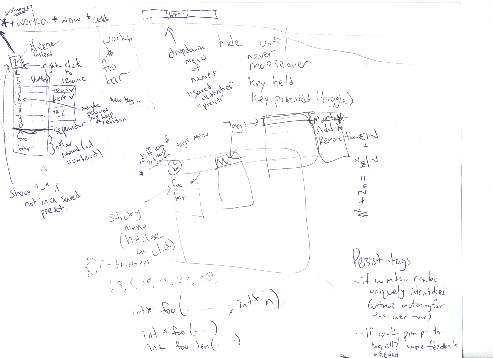

# Tasks

- The idea is a menu of presets in the top left, and a list of
  currently visible window tags (tasks) beside it.
- Right-click a window tag name to remove it (hide it).
- The \* refers to the set of windows that are not tagged.
- The right-most tag is always "add" which is a menu of tags when
  clicked, to add a tag to the list/show the tagged set of windows.
  - Under add is "new tag..." to create a new tag (should probably
    exist in window tag menu also)
- You get 10 numbered presets by default and can add named ones.
- Presets hold a set of tags. The menu shows all tags and lets you
  check/uncheck them.
- Windows have a tag menu which lets you associate a tag with it
  quickly.
- The top bar can be shown:
  - Always
  - On mouseover
  - While key held down
  - When key pressed (toggled)
- KDE has something like this system now.

