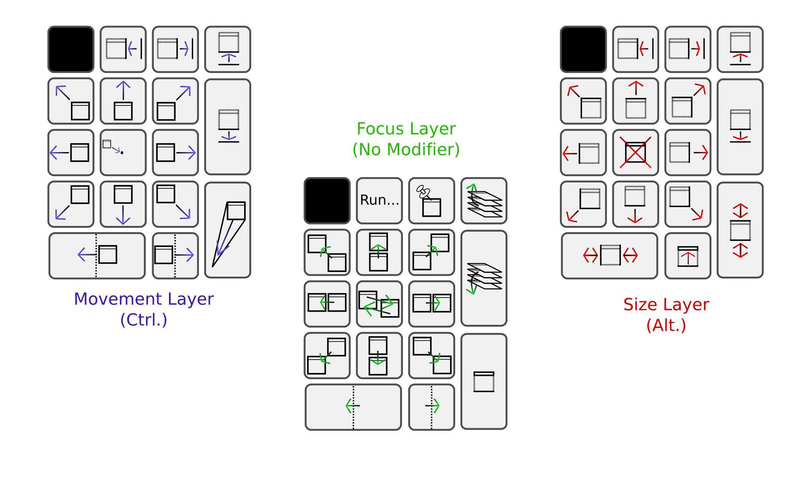
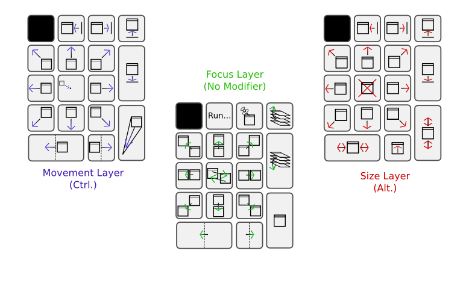
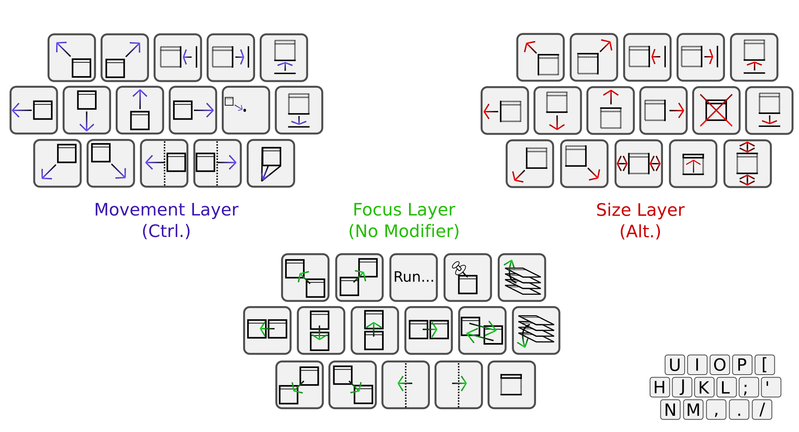
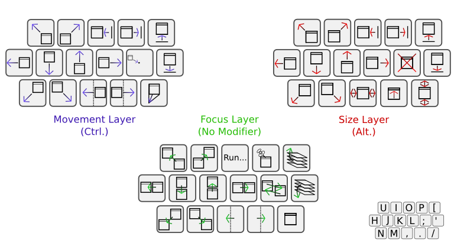

# Clay Barnes' Vim-Style Openbox bindings






(Taken from [Clay Barnes' blog entry](http://hci-matters.com/blog/?p=7))

These bindings were originally designed to prove that all window managments
functions could be effectivly replaced by modifier keys and the number pad.
Eventually they were ported to a vaguely vi-styled main keyboard design.

Note that the images do not document the direct-to workspace bindings or
several redundant/transitional extra bindings:

1. `W-F[n]` goes to workspace `[n]`
2. `W-C-F[n]` goes to workspace `[n]` bringing the currently selected application along
3. `W-C-F[n]` sends the currently selected application to workspace `[n]`
4. `W-tab/W-S-tab` emulate traditional alt-tab designs
5. `W-backslash/W-S-backslash` switch to the next/previous workspaces
6. `W-T` opens a terminal
7. and several others (see the xml)

```xml
<?xml version="1.0" encoding="UTF-8"?>

<openbox_config ns="http://openbox.org/"
  xmlns:xsi="http://www.w3.org/2001/XMLSchema-instance"
  xsi:schemaLocation="http://openbox.org/ file:///home/clay/openbox/rc.xsd">
<!--  Clay's keybindings: "Collision-Free Commanding"
A prototype interaction paradigm based off of muscle-memory and vi-style
bindings, and designed to avoid any key binding collisions with programs,
all interactions (that could possibly be sent to an application) include
the Super/Meta4 key (often labled the "Windows Key").
-->
<applications>
  <!-- match all windows, and remove their decorations -->
  <application class="*">
    <decor>no</decor>
  </application>
</applications>

<resistance>
  <strength>25</strength>
  <screen_edge_strength>50</screen_edge_strength>
</resistance>

<focus>
  <focusNew>yes</focusNew>
  <followMouse>yes</followMouse>
  <focusLast>yes</focusLast>
  <focusDelay>0</focusDelay>
  <raiseOnFocus>no</raiseOnFocus>
</focus>

<theme>
  <name>Nop</name>
  <titlelayout>NLIMC</titlelayout>
  <animateIconify>no</animateIconify>
</theme>

<placement>
  <policy>Smart</policy>
</placement>

<desktops>
  <number>12</number>
  <firstdesk>1</firstdesk>
  <names>
    <name>Alpha (1)</name>
    <name>Beta (2)</name>
    <name>Gamma (3)</name>
    <name>Delta (4)</name>
    <name>Epsilon (5)</name>
    <name>Zeta (6)</name>
    <name>Eta (7)</name>
    <name>Theta (8)</name>
    <name>Iota (9)</name>
    <name>Kappa (10)</name>
    <name>Lambda (11)</name>
    <name>Mu (12)</name>
  </names>
</desktops>

<resize>
  <drawContents>yes</drawContents>
</resize>

<dock>
  <position>TopLeft</position>
  <stacking>Top</stacking>
  <direction>Vertical</direction>
  <floatingX>0</floatingX>
  <floatingY>0</floatingY>
  <autoHide>yes</autoHide>
  <hideDelay>500</hideDelay>
  <moveButton>W-Left</moveButton>
</dock>

<keyboard>
  <chainQuitKey>W-q</chainQuitKey>

<!--XXXXXXXXXXXXXXXXXXXXXXXXXXXXXXXXXXXXXXXXXXXXXXXXXXXXXXXXXXXXXXXXXXXXXXXXX-->
<!--XXXX              (Almost) One-handed Control Prototype              XXXX-->
<!--XXXXXXXXXXXXXXXXXXXXXXXXXXXXXXXXXXXXXXXXXXXXXXXXXXXXXXXXXXXXXXXXXXXXXXXXX-->
<!--Movement Layer-->
  <keybind key="W-C-KP_7">      <action name="MoveToEdgeNorthWest"/>    </keybind>
  <keybind key="W-C-KP_9">      <action name="MoveToEdgeNorthEast"/>    </keybind>
  <keybind key="W-C-KP_1">      <action name="MoveToEdgeSouthWest"/>    </keybind>
  <keybind key="W-C-KP_3">      <action name="MoveToEdgeSouthEast"/>    </keybind>
  <keybind key="W-C-U">         <action name="MoveToEdgeNorthWest"/>    </keybind>
  <keybind key="W-C-I">         <action name="MoveToEdgeNorthEast"/>    </keybind>
  <keybind key="W-C-N">         <action name="MoveToEdgeSouthWest"/>    </keybind>
  <keybind key="W-C-M">         <action name="MoveToEdgeSouthEast"/>    </keybind>


  <keybind key="W-C-KP_8">      <action name="MoveToEdgeNorth"/>    </keybind>
  <keybind key="W-C-K">         <action name="MoveToEdgeNorth"/>    </keybind>
  <keybind key="W-C-KP_4">      <action name="MoveToEdgeWest"/>     </keybind>
  <keybind key="W-C-H">         <action name="MoveToEdgeWest"/>     </keybind>
  <keybind key="W-C-KP_5">      <action name="MoveToCenter"/>       </keybind>
  <keybind key="W-C-semicolon">     <action name="MoveToCenter"/>       </keybind>
  <keybind key="W-C-KP_6">      <action name="MoveToEdgeEast"/>     </keybind>
  <keybind key="W-C-L">         <action name="MoveToEdgeEast"/>     </keybind>
  <keybind key="W-C-KP_2">      <action name="MoveToEdgeSouth"/>    </keybind>
  <keybind key="W-C-J">         <action name="MoveToEdgeSouth"/>    </keybind>

  <keybind key="W-C-KP_0">      <action name="SendToDesktopPrevious"><dialog>no</dialog></action>   </keybind>
  <keybind key="W-C-comma">     <action name="SendToDesktopPrevious"><dialog>no</dialog></action>   </keybind>

  <keybind key="W-C-KP_Decimal">    <action name="SendToDesktopNext"><dialog>no</dialog></action>   </keybind>
  <keybind key="W-C-period">        <action name="SendToDesktopNext"><dialog>no</dialog></action>   </keybind>

  <keybind key="W-C-KP_Divide">     <action name="MoveRelative"><x>-20</x></action> </keybind>
  <keybind key="W-C-O">         <action name="MoveRelative"><x>-20</x></action> </keybind>
  <keybind key="W-C-KP_Multiply">   <action name="MoveRelative"><x>20</x></action>  </keybind>
  <keybind key="W-C-P">         <action name="MoveRelative"><x>20</x></action>  </keybind>
  <keybind key="W-C-KP_Subtract">   <action name="MoveRelative"><y>-20</y></action> </keybind>
  <keybind key="W-C-bracketleft">   <action name="MoveRelative"><y>-20</y></action> </keybind>
  <keybind key="W-C-KP_Add">        <action name="MoveRelative"><y>20</y></action>  </keybind>
  <keybind key="W-C-apostrophe">    <action name="MoveRelative"><y>20</y></action>  </keybind>

  <keybind key="W-C-KP_Enter">      <action name="Iconify"/>        </keybind>
  <keybind key="W-C-slash">     <action name="Iconify"/>        </keybind>
<!--END of Movement Layer-->

<!--Focus Layer-->
  <keybind key="W-KP_7">    <action name="DirectionalFocusNorthWest"/>  </keybind>
  <keybind key="W-KP_9">    <action name="DirectionalFocusNorthEast"/>  </keybind>
  <keybind key="W-KP_1">    <action name="DirectionalFocusSouthWest"/>  </keybind>
  <keybind key="W-KP_3">    <action name="DirectionalFocusSouthEast"/>  </keybind>
  <keybind key="W-U">       <action name="DirectionalFocusNorthWest"/>  </keybind>
  <keybind key="W-I">       <action name="DirectionalFocusNorthEast"/>  </keybind>
  <keybind key="W-N">       <action name="DirectionalFocusSouthWest"/>  </keybind>
  <keybind key="W-M">       <action name="DirectionalFocusSouthEast"/>  </keybind>
  <keybind key="W-S-KP_5">  <action name="PreviousWindow"/>         </keybind>

  <keybind key="W-KP_8">    <action name="DirectionalFocusNorth"/>      </keybind>
  <keybind key="W-K">       <action name="DirectionalFocusNorth"/>      </keybind>
  <keybind key="W-KP_4">    <action name="DirectionalFocusWest"/>       </keybind>
  <keybind key="W-H">       <action name="DirectionalFocusWest"/>       </keybind>
  <keybind key="W-KP_5">    <action name="NextWindow"/>         </keybind>
  <keybind key="W-semicolon">   <action name="NextWindow"/>         </keybind>
  <keybind key="W-S-KP_5">  <action name="PreviousWindow"/>         </keybind>
  <keybind key="W-S-semicolon"> <action name="PreviousWindow"/>         </keybind>
  <keybind key="W-KP_6">    <action name="DirectionalFocusEast"/>       </keybind>
  <keybind key="W-L">       <action name="DirectionalFocusEast"/>       </keybind>
  <keybind key="W-KP_2">    <action name="DirectionalFocusSouth"/>      </keybind>
  <keybind key="W-J">       <action name="DirectionalFocusSouth"/>      </keybind>

  <keybind key="W-KP_0">    <action name="DesktopPrevious"/>        </keybind>
  <keybind key="W-comma">   <action name="DesktopPrevious"/>        </keybind>
  <keybind key="W-KP_Decimal">  <action name="DesktopNext"/>            </keybind>
  <keybind key="W-period">  <action name="DesktopNext"/>            </keybind>

  <keybind key="W-KP_Divide">   <action name="Execute"><command>gmrun</command></action>    </keybind>
  <keybind key="W-O">       <action name="Execute"><command>gmrun</command></action>    </keybind>

  <keybind key="W-KP_Multiply"> <action name="ToggleOmnipresent"/>      </keybind>
  <keybind key="W-P">       <action name="ToggleOmnipresent"/>      </keybind>

  <keybind key="W-KP_Subtract"> <action name="Raise"/>              </keybind>
  <keybind key="W-bracketleft"> <action name="Raise"/>              </keybind>
  <keybind key="W-KP_Add">  <action name="Lower"/>              </keybind>
  <keybind key="W-apostrophe">  <action name="Lower"/>              </keybind>

  <keybind key="W-KP_Enter">    <action name="ToggleDecorations"/>      </keybind>
  <keybind key="W-slash">   <action name="ToggleDecorations"/>      </keybind>

<!--END Focus Layer-->

<!--Size Layer-->
  <keybind key="W-A-KP_7">  <action name="GrowToEdgeNorthWest"/>        </keybind>
  <keybind key="W-A-KP_9">  <action name="GrowToEdgeNorthEast"/>        </keybind>
  <keybind key="W-A-KP_1">  <action name="GrowToEdgeSouthWest"/>        </keybind>
  <keybind key="W-A-KP_3">  <action name="GrowToEdgeSouthEast"/>        </keybind>
  <keybind key="W-A-U">     <action name="GrowToEdgeNorthWest"/>        </keybind>
  <keybind key="W-A-I">     <action name="GrowToEdgeNorthEast"/>        </keybind>
  <keybind key="W-A-N">     <action name="GrowToEdgeSouthWest"/>        </keybind>
  <keybind key="W-A-M">     <action name="GrowToEdgeSouthEast"/>        </keybind>

  <keybind key="W-A-KP_8">  <action name="GrowToEdgeNorth"/>        </keybind>
  <keybind key="W-A-K">     <action name="GrowToEdgeNorth"/>        </keybind>
  <keybind key="W-A-KP_4">  <action name="GrowToEdgeWest"/>         </keybind>
  <keybind key="W-A-H">     <action name="GrowToEdgeWest"/>         </keybind>
  <keybind key="W-A-KP_5">  <action name="Close"/>              </keybind>
  <keybind key="W-A-semicolon"> <action name="Close"/>              </keybind>
  <keybind key="W-A-KP_6">  <action name="GrowToEdgeEast"/>         </keybind>
  <keybind key="W-A-L">     <action name="GrowToEdgeEast"/>         </keybind>
  <keybind key="W-A-KP_2">  <action name="GrowToEdgeSouth"/>        </keybind>
  <keybind key="W-A-J">     <action name="GrowToEdgeSouth"/>        </keybind>

  <keybind key="W-A-KP_Divide">     <action name="ResizeRelative"><right>-20</right></action>   </keybind>
  <keybind key="W-A-O">         <action name="ResizeRelative"><right>-20</right></action>   </keybind>
  <keybind key="W-A-KP_Multiply">   <action name="ResizeRelative"><right>20</right></action>    </keybind>
  <keybind key="W-A-P">         <action name="ResizeRelative"><right>20</right></action>    </keybind>
  <keybind key="W-A-KP_Subtract">   <action name="ResizeRelative"><bottom>-20</bottom></action> </keybind>
  <keybind key="W-A-bracketleft">   <action name="ResizeRelative"><bottom>-20</bottom></action> </keybind>
  <keybind key="W-A-KP_Add">        <action name="ResizeRelative"><bottom>20</bottom></action>  </keybind>
  <keybind key="W-A-apostrophe">    <action name="ResizeRelative"><bottom>20</bottom></action>  </keybind>

  <keybind key="W-A-KP_0">      <action name="ToggleMaximizeHorz"/> </keybind>
  <keybind key="W-A-comma">     <action name="ToggleMaximizeHorz"/> </keybind>
  <keybind key="W-A-KP_Decimal">    <action name="ToggleShade"/>        </keybind>
  <keybind key="W-A-period">        <action name="ToggleShade"/>        </keybind>
  <keybind key="W-A-KP_Enter">      <action name="ToggleMaximizeVert"/> </keybind>
  <keybind key="W-A-slash">     <action name="ToggleMaximizeVert"/> </keybind>

<!--END of Size Layer-->

<!--XXXXXXXXXXXXXXXXXXXXXXXXXXXXXXXXXXXXXXXXXXXXXXXXXXXXXXXXXXXXXXXXXXXXXXXXX-->

<!--Workspace Switch Bindings-->
  <keybind key="W-C-F1">    <action name="SendToDesktop"><desktop>1</desktop><follow>yes</follow></action>  </keybind>
  <keybind key="W-C-F2">    <action name="SendToDesktop"><desktop>2</desktop><follow>yes</follow></action>  </keybind>
  <keybind key="W-C-F3">    <action name="SendToDesktop"><desktop>3</desktop><follow>yes</follow></action>  </keybind>
  <keybind key="W-C-F4">    <action name="SendToDesktop"><desktop>4</desktop><follow>yes</follow></action>  </keybind>
  <keybind key="W-C-F5">    <action name="SendToDesktop"><desktop>5</desktop><follow>yes</follow></action>  </keybind>
  <keybind key="W-C-F6">    <action name="SendToDesktop"><desktop>6</desktop><follow>yes</follow></action>  </keybind>
  <keybind key="W-C-F7">    <action name="SendToDesktop"><desktop>7</desktop><follow>yes</follow></action>  </keybind>
  <keybind key="W-C-F8">    <action name="SendToDesktop"><desktop>8</desktop><follow>yes</follow></action>  </keybind>
  <keybind key="W-C-F9">    <action name="SendToDesktop"><desktop>9</desktop><follow>yes</follow></action>  </keybind>
  <keybind key="W-C-F10">   <action name="SendToDesktop"><desktop>10</desktop><follow>yes</follow></action> </keybind>
  <keybind key="W-C-F11">   <action name="SendToDesktop"><desktop>11</desktop><follow>yes</follow></action> </keybind>
  <keybind key="W-C-F12">   <action name="SendToDesktop"><desktop>12</desktop><follow>yes</follow></action> </keybind>

  <keybind key="W-F1">  <action name="Desktop"><desktop>1</desktop><dialog>yes</dialog></action>    </keybind>
  <keybind key="W-F2">  <action name="Desktop"><desktop>2</desktop><dialog>yes</dialog></action>    </keybind>
  <keybind key="W-F3">  <action name="Desktop"><desktop>3</desktop><dialog>yes</dialog></action>    </keybind>
  <keybind key="W-F4">  <action name="Desktop"><desktop>4</desktop><dialog>yes</dialog></action>    </keybind>
  <keybind key="W-F5">  <action name="Desktop"><desktop>5</desktop><dialog>yes</dialog></action>    </keybind>
  <keybind key="W-F6">  <action name="Desktop"><desktop>6</desktop><dialog>yes</dialog></action>    </keybind>
  <keybind key="W-F7">  <action name="Desktop"><desktop>7</desktop><dialog>yes</dialog></action>    </keybind>
  <keybind key="W-F8">  <action name="Desktop"><desktop>8</desktop><dialog>yes</dialog></action>    </keybind>
  <keybind key="W-F9">  <action name="Desktop"><desktop>9</desktop><dialog>yes</dialog></action>    </keybind>
  <keybind key="W-F10"> <action name="Desktop"><desktop>10</desktop><dialog>yes</dialog></action>   </keybind>
  <keybind key="W-F11"> <action name="Desktop"><desktop>11</desktop><dialog>yes</dialog></action>   </keybind>
  <keybind key="W-F12"> <action name="Desktop"><desktop>12</desktop><dialog>yes</dialog></action>   </keybind>

  <keybind key="W-A-F1">    <action name="SendToDesktop"><desktop>1</desktop><follow>no</follow></action>   </keybind>
  <keybind key="W-A-F2">    <action name="SendToDesktop"><desktop>2</desktop><follow>no</follow></action>   </keybind>
  <keybind key="W-A-F3">    <action name="SendToDesktop"><desktop>3</desktop><follow>no</follow></action>   </keybind>
  <keybind key="W-A-F4">    <action name="SendToDesktop"><desktop>4</desktop><follow>no</follow></action>   </keybind>
  <keybind key="W-A-F5">    <action name="SendToDesktop"><desktop>5</desktop><follow>no</follow></action>   </keybind>
  <keybind key="W-A-F6">    <action name="SendToDesktop"><desktop>6</desktop><follow>no</follow></action>   </keybind>
  <keybind key="W-A-F7">    <action name="SendToDesktop"><desktop>7</desktop><follow>no</follow></action>   </keybind>
  <keybind key="W-A-F8">    <action name="SendToDesktop"><desktop>8</desktop><follow>no</follow></action>   </keybind>
  <keybind key="W-A-F9">    <action name="SendToDesktop"><desktop>9</desktop><follow>no</follow></action>   </keybind>
  <keybind key="W-A-F10">   <action name="SendToDesktop"><desktop>10</desktop><follow>no</follow></action>  </keybind>
  <keybind key="W-A-F11">   <action name="SendToDesktop"><desktop>11</desktop><follow>no</follow></action>  </keybind>
  <keybind key="W-A-F12">   <action name="SendToDesktop"><desktop>12</desktop><follow>no</follow></action>  </keybind>

<!-- Workspace Switch Bindings -->
  <keybind key="W-backslash">       <action name="DesktopNext"><wrap>yes</wrap><dialog>no</dialog></action>     </keybind>
  <keybind key="XF86AudioRaiseVolume">  <action name="DesktopNext"><wrap>yes</wrap><dialog>no</dialog></action>     </keybind>
  <keybind key="W-S-backslash">     <action name="DesktopPrevious"><wrap>yes</wrap><dialog>no</dialog></action> </keybind>
  <keybind key="XF86AudioLowerVolume">  <action name="DesktopPrevious"><wrap>yes</wrap><dialog>no</dialog></action> </keybind>
<!-- END of Workspace Switch Bindings -->

<!-- Application Switch Bindings -->
  <keybind key="W-Tab">     <action name="NextWindow"/>     </keybind>
  <keybind key="W-S-Tab">   <action name="PreviousWindow"/>     </keybind>
<!-- END of Application Switch Bindings -->

<!--Show Menu Bindings-->
  <keybind key="W-Menu">    <action name="ShowMenu"><menu>client-menu</menu></action>   </keybind>
  <keybind key="W-grave">   <action name="ShowMenu"><menu>client-list-menu</menu></action>  </keybind>
  <keybind key="XF86Go">    <action name="ShowMenu"><menu>root-menu</menu></action>     </keybind>
  <keybind key="XF86Back">  <action name="ShowMenu"><menu>client-list-menu</menu></action>  </keybind>
<!--END of Show Menu Bindings-->

  <keybind key="W-Print">
    <action name="ShowMenu"><menu>root-menu</menu></action>
  </keybind>
  <keybind key="W-Scroll_Lock">
    <action name="ShowMenu"><menu>client-list-menu</menu></action>
  </keybind>
  <keybind key="W-Pause">
    <action name="Execute"><command>xscreensaver-command -l</command></action>
  </keybind>
  <keybind key="XF86UserPB">
    <action name="Execute"><command>xscreensaver-command -l</command></action>
  </keybind>

  <keybind key="W-r">
    <action name="Execute"><command>rox</command></action>
  </keybind>
  <keybind key="W-t">
    <action name="Execute"><command>urxvt -bg black -fg white +sb -sl 1024</command></action>
  </keybind>

</keyboard>

<mouse>
  <dragThreshold>3</dragThreshold>
  <doubleClickTime>200</doubleClickTime>

  <context name="Frame">
    <mousebind button="W-Left" action="Drag">
      <action name="Move"/>
    </mousebind>
    <mousebind button="W-Left" action="Click">
      <action name="Raise"/>
    </mousebind>
    <mousebind button="W-Left" action="Press">
      <action name="Focus"/>
    </mousebind>
    <mousebind button="W-Right" action="Drag">
      <action name="Resize"/>
    </mousebind>
    <mousebind button="W-Middle" action="Click">
      <action name="Lower"/>
    </mousebind>
    <mousebind button="W-Middle" action="Press">
      <action name="ShowMenu"><menu>client-menu</menu></action>
    </mousebind>
    <mousebind button="W-Up" action="Click">
      <action name="DesktopNext"><wrap>yes</wrap><dialog>yes</dialog></action>
    </mousebind>
    <mousebind button="W-Down" action="Click">
      <action name="DesktopPrevious"><wrap>yes</wrap><dialog>yes</dialog></action>
    </mousebind>
    <mousebind button="W-A-Up" action="Click">
      <action name="SendToDesktopPrevious"/>
    </mousebind>
    <mousebind button="W-A-Down" action="Click">
      <action name="SendToDesktopNext"/>
    </mousebind>
  </context>
  <context name="Titlebar">
    <mousebind button="Left" action="Drag">
      <action name="Move"/>
    </mousebind>
    <mousebind button="Left" action="Click">
      <action name="Raise"/>
    </mousebind>
    <mousebind button="Left" action="Press">
      <action name="Focus"/>
    </mousebind>
    <mousebind button="Left" action="DoubleClick">
      <action name="ToggleShade"/>
    </mousebind>
    <mousebind button="Middle" action="Press">
      <action name="Lower"/>
    </mousebind>
    <mousebind button="Up" action="Click">
      <action name="Shade"/>
    </mousebind>
    <mousebind button="Down" action="Click">
      <action name="Unshade"/>
    </mousebind>
    <mousebind button="Right" action="Press">
      <action name="ShowMenu"><menu>client-menu</menu></action>
    </mousebind>
  </context>
  <context name="Handle">
    <mousebind button="Left" action="Drag">
      <action name="Move"/>
    </mousebind>
    <mousebind button="Left" action="Click">
      <action name="Raise"/>
    </mousebind>
    <mousebind button="Left" action="Press">
      <action name="Focus"/>
    </mousebind>
    <mousebind button="Middle" action="Press">
      <action name="Lower"/>
    </mousebind>
  </context>
  <context name="BLCorner">
    <mousebind button="Left" action="Drag">
      <action name="Resize"/>
    </mousebind>
    <mousebind button="Left" action="Press">
      <action name="Focus"/>
    </mousebind>
  </context>
  <context name="BRCorner">
    <mousebind button="Left" action="Drag">
      <action name="Resize"/>
    </mousebind>
    <mousebind button="Left" action="Press">
      <action name="Focus"/>
    </mousebind>
  </context>
  <context name="TLCorner">
    <mousebind button="Left" action="Drag">
      <action name="Resize"/>
    </mousebind>
    <mousebind button="Left" action="Press">
      <action name="Focus"/>
    </mousebind>
  </context>
  <context name="TRCorner">
    <mousebind button="Left" action="Drag">
      <action name="Resize"/>
    </mousebind>
    <mousebind button="Left" action="Press">
      <action name="Focus"/>
    </mousebind>
  </context>
  <context name="Client">
    <mousebind button="Left" action="Press">
      <action name="Focus"/>
      <action name="Raise"/>
    </mousebind>
    <mousebind button="Middle" action="Press">
      <action name="Focus"/>
    </mousebind>
    <mousebind button="Right" action="Press">
      <action name="Focus"/>
    </mousebind>
  </context>
  <context name="Icon">
    <mousebind button="Left" action="Press">
      <action name="Focus"/>
    </mousebind>
    <mousebind button="Right" action="Press">
      <action name="ShowMenu"><menu>client-menu</menu></action>
    </mousebind>
    <mousebind button="Left" action="Press">
      <action name="ShowMenu"><menu>client-menu</menu></action>
    </mousebind>
  </context>
  <context name="AllDesktops">
    <mousebind button="Left" action="Press">
      <action name="Focus"/>
    </mousebind>
    <mousebind button="Left" action="Click">
      <action name="ToggleOmnipresent"/>
    </mousebind>
  </context>
  <context name="Shade">
    <mousebind button="Left" action="Press">
      <action name="Focus"/>
    </mousebind>
    <mousebind button="Left" action="Click">
      <action name="ToggleShade"/>
    </mousebind>
  </context>
  <context name="Iconify">
    <mousebind button="Left" action="Press">
      <action name="Focus"/>
    </mousebind>
    <mousebind button="Left" action="Click">
      <action name="Iconify"/>
    </mousebind>
  </context>
  <context name="Maximize">
    <mousebind button="Left" action="Press">
      <action name="Focus"/>
    </mousebind>
    <mousebind button="Middle" action="Press">
      <action name="Focus"/>
    </mousebind>
    <mousebind button="Right" action="Press">
      <action name="Focus"/>
    </mousebind>
    <mousebind button="Left" action="Click">
      <action name="ToggleMaximizeFull"/>
    </mousebind>
    <mousebind button="Middle" action="Click">
      <action name="ToggleMaximizeVert"/>
    </mousebind>
    <mousebind button="Right" action="Click">
      <action name="ToggleMaximizeHorz"/>
    </mousebind>
  </context>
  <context name="Close">
    <mousebind button="Left" action="Press">
      <action name="Focus"/>
    </mousebind>
    <mousebind button="Left" action="Click">
      <action name="Close"/>
    </mousebind>
  </context>
  <context name="Desktop">
    <mousebind button="W-Up" action="Press">
      <action name="DesktopNext"><wrap>yes</wrap><dialog>yes</dialog></action>
    </mousebind>
    <mousebind button="W-Down" action="Press">
      <action name="DesktopPrevious"><wrap>yes</wrap><dialog>yes</dialog></action>
    </mousebind>
    <mousebind button="Left" action="Press">
      <action name="Focus"/>
      <action name="Raise"/>
    </mousebind>
    <mousebind button="Middle" action="Press">
      <action name="ShowMenu"><menu>client-list-menu</menu></action>
    </mousebind>
    <mousebind button="Right" action="Press">
      <action name="ShowMenu"><menu>root-menu</menu></action>
    </mousebind>
  </context>
  <context name="MoveResize">
    <mousebind button="Up" action="Press">
      <action name="DesktopNext"><wrap>yes</wrap><dialog>yes</dialog></action>
    </mousebind>
    <mousebind button="Down" action="Press">
      <action name="DesktopPrevious"><wrap>yes</wrap><dialog>yes</dialog></action>
    </mousebind>
  </context>
</mouse>

<menu>
  <!-- You can specify more than one menu file in here and they are all loaded,
        just don't make menu ids clash or, well, it'll be kind of pointless -->

  <!-- default menu file (or custom one in $HOME/.config/openbox/) -->
  <file>$HOME/openbox/menu.xml</file>
</menu>

</openbox_config>
```

## Alternate Vim-style ctrl-w Bindings

Since I am extremely lazy and have a poor memory, I wanted even more
Vim-like windows bindings than the above example. I came up with the
following which tries to closely emulate the regular Vim `ctrl-w`
multi-window controls, substituting the Windows key for `ctrl`.

This is not a complete `rc.xml`, the following should be placed within
your regular `<keyboard></keyboard>` section. I only use four virtual
desktops, so you'll need to add additional lines if you use more.

```xml
<keybind key="W-w">
  <!-- "Move the cursor to other windows" to move windows -->
  <keybind key="h"><action name="MoveToEdgeWest"/></keybind>
  <keybind key="l"><action name="MoveToEdgeEast"/></keybind>
  <keybind key="j"><action name="MoveToEdgeSouth"/></keybind>
  <keybind key="k"><action name="MoveToEdgeNorth"/></keybind>
  <!-- This a fudge, as there isn't a great Vim equivalent -->
  <keybind key="equal"><action name="MoveToCenter"/></keybind>

  <!-- "Move the window" to grow windows -->
  <keybind key="S-h"><action name="GrowToEdgeWest"/></keybind>
  <keybind key="S-l"><action name="GrowToEdgeEast"/></keybind>
  <keybind key="S-j"><action name="GrowToEdgeSouth"/></keybind>
  <keybind key="S-k"><action name="GrowToEdgeNorth"/></keybind>

  <!-- the following blocks have fairly canonical Vim equivalents -->
  <keybind key="S-bar"><action name="ToggleMaximizeHorz"/></keybind>
  <keybind key="S-underscore"><action name="ToggleMaximizeVert"/></keybind>

  <keybind key="S-less"><action name="ResizeRelative"><left>2</left></action></keybind>
  <keybind key="S-greater"><action name="ResizeRelative"><right>2</right></action></keybind>
  <keybind key="S-plus"><action name="ResizeRelative"><top>2</top></action></keybind>
  <keybind key="minus"><action name="ResizeRelative"><bottom>2</bottom></action></keybind>

  <keybind key="o"><action name="ToggleMaximizeFull"/></keybind>
  <keybind key="c"><action name="Close"/></keybind>
  <keybind key="p"><action name="DesktopLast"/></keybind>

  <!-- "Split windows" to send them to nearby destops, "vertical splits" don't follow
        Use a "count" to send a window to a specific desktop.
        Special case: using a capital when using a "count" sends the window to a specific monitor. -->
  <keybind key="s"><action name="SendToDesktopNext"><follow>yes</follow></action></keybind>
  <keybind key="S-s"><action name="SendToDesktopPrevious"><follow>yes</follow></action></keybind>
  <keybind key="v"><action name="SendToDesktopNext"><follow>no</follow></action></keybind>
  <keybind key="S-v"><action name="SendToDesktopPrevious"><follow>no</follow></action></keybind>

  <keybind key="1">
    <keybind key="s"><action name="SendToDesktop"><desktop>1</desktop><follow>yes</follow></action></keybind>
    <keybind key="v"><action name="SendToDesktop"><desktop>1</desktop><follow>no</follow></action></keybind>
    <keybind key="S-s"><action name="MoveResizeTo"><monitor>1</monitor></action></keybind>
  </keybind>
  <keybind key="2">
    <keybind key="s"><action name="SendToDesktop"><desktop>2</desktop><follow>yes</follow></action></keybind>
    <keybind key="v"><action name="SendToDesktop"><desktop>2</desktop><follow>no</follow></action></keybind>
    <keybind key="S-s"><action name="MoveResizeTo"><monitor>2</monitor></action></keybind>
  </keybind>
  <keybind key="3">
    <keybind key="s"><action name="SendToDesktop"><desktop>3</desktop><follow>yes</follow></action></keybind>
    <keybind key="v"><action name="SendToDesktop"><desktop>3</desktop><follow>no</follow></action></keybind>
    <keybind key="S-s"><action name="MoveResizeTo"><monitor>3</monitor></action></keybind>
  </keybind>
  <keybind key="4">
    <keybind key="s"><action name="SendToDesktop"><desktop>4</desktop><follow>yes</follow></action></keybind>
    <keybind key="v"><action name="SendToDesktop"><desktop>4</desktop><follow>no</follow></action></keybind>
    <keybind key="S-s"><action name="MoveResizeTo"><monitor>4</monitor></action></keybind>
  </keybind>
</keybind>
```
