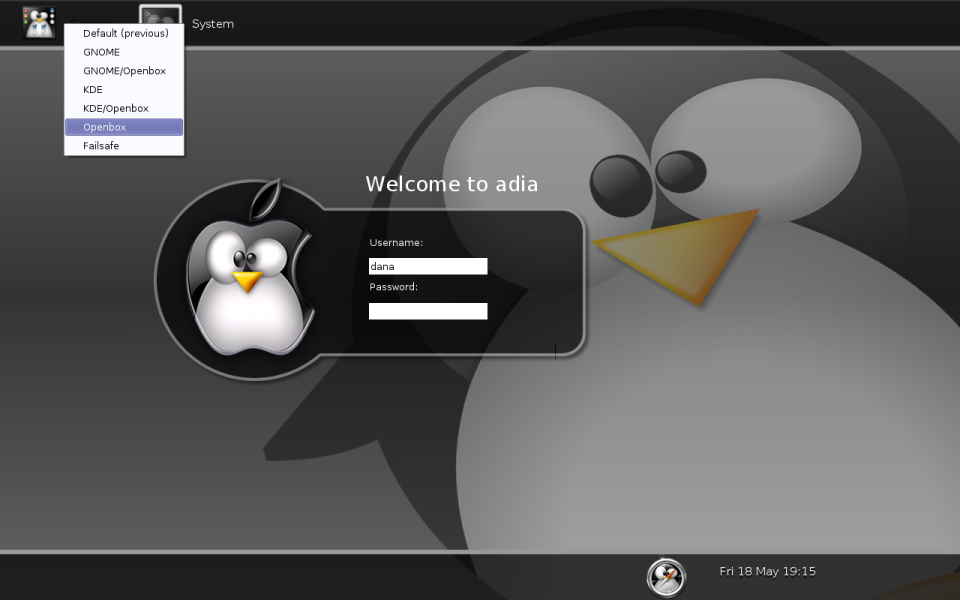
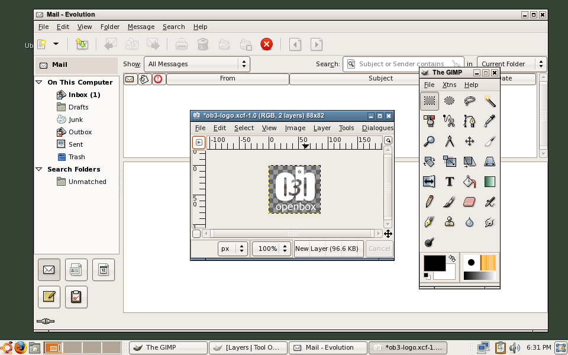
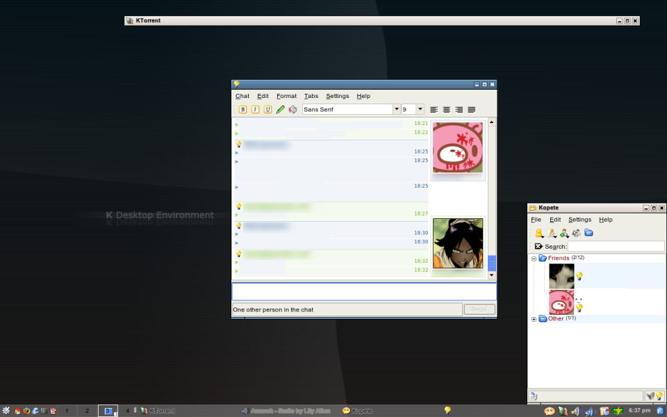
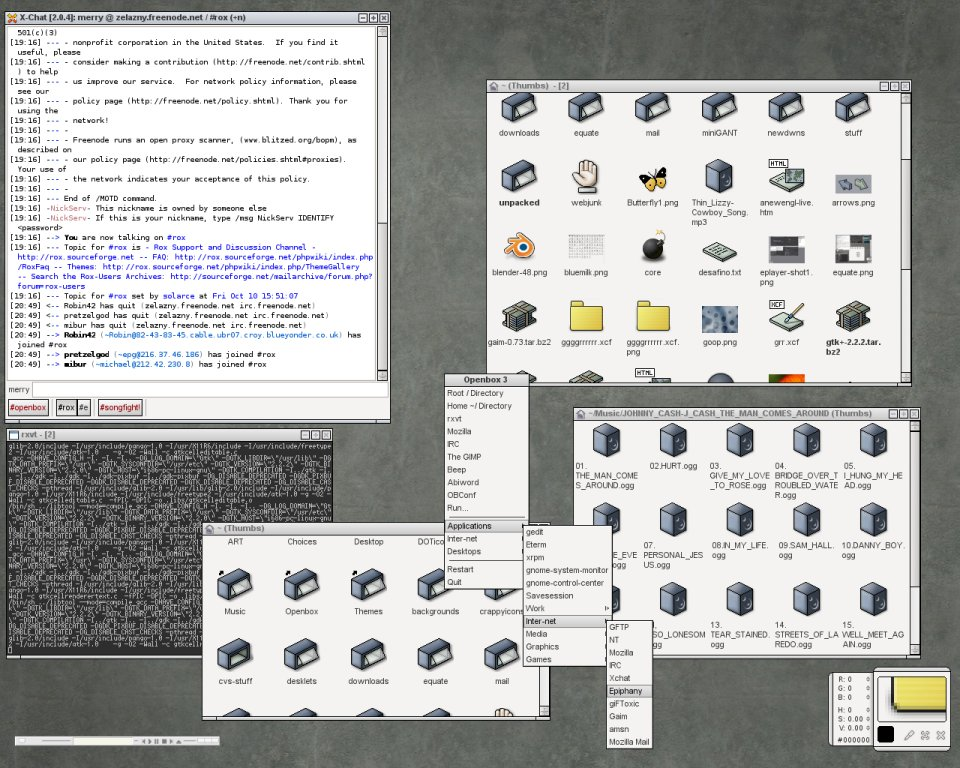

# Getting started

Openbox is included in [most popular linux distributions](DistrosAndDEsUsingOpenbox.md).
However if the latest version is not available to you through your distribution,
you can download it from the [download page](../Download.md).
Packages are available there for a few distrubutions, as well as the source code
which you can compile yourself. For help compiling Openbox, please see our
[compiling guide](Installing.md).

Once Openbox is installed, running it is quite simple whether you log in
through the graphical interface or through a text-based terminal.
We'll first talk about the ways to run Openbox from a graphical log in (GDM/KDM),
and then show how to run those same sessions from the command line.

## Starting Openbox from a graphical log in

 Openbox provides three menu
options that will be in the Session Type menu when you are logging in,
if they are available. The "GNOME/Openbox" option will only be present
if you have GNOME installed, and the "KDE/Openbox" option
will appear only if KDE is installed.

### Using Openbox in a desktop environment (GNOME and KDE)

Openbox can run inside the [GNOME], [KDE], or [LXDE] desktop environments,
giving you all the power and features of Openbox alongside everything
these desktop environments have to offer.
Options to run Openbox inside of these desktop environments are provided
by default in the Session Type menu when logging in graphically, as seen in Figure 1.
Choosing the "GNOME/Openbox" or "KDE/Openbox" option will log into the respective
desktop environment with Openbox replacing the default window manager.

[GNOME]: https://www.gnome.org
[KDE]:   https://kde.org
[LXDE]:  https://www.lxde.org

If you use [lxdm], make sure it is version 0.3.0 or newer.
Older versions had a [bug] which interfered with sessions other than LXDE.

[lxdm]: https://wiki.lxde.org/en/LXDM
[bug]:  https://bugs.launchpad.net/ubuntu/+source/lxdm/+bug/556611

See [Using Openbox in GNOME](UsingOpenboxInGNOME.md) for further tips and assistance.

### Using Openbox without a desktop environment (The lightweight approach)

By default, a third "Openbox" option is provided in the Session Type menu
when logging in graphically, as can be seen in Figure 1.
This option will run a more lightweight Openbox session
without any desktop environment or session manager.

When choosing this option, the [autostart](Autostart.md)
file is executed before launching Openbox, so that you can run any
applications you want to start alongside Openbox and set up the
environment as neccessary. Openbox comes with a default autostart which
sets up an environment for both GNOME and KDE applications to run
properly in (if you have them installed), as well as providing support
for SCIM language input. See the [autostart documentation](Autostart.md)
for more details on setting it up.

To have a taskbar on screen, install and use a panel program like
`gnome-panel`, `pypanel`, `perlpanel` or `fbpanel`. Our
[list of programs to use with Openbox](Session.md#panels-widgets-desktops-pagers-etc)
lists a number of such programs.

## Starting Openbox without the graphical log in

If you don't use a graphical log in, there are three programs included
with Openbox for launching Openbox sessions similar to the three menu
options discussed above.

Most likely if you are not using a graphical log in, then you are using
startx to begin an X session. In that case you need to run Openbox from
your `~/.xinitrc` file. Rather than just running `openbox` however, you
should choose from one of the three programs listed below:

- `openbox-session`

This runs an Openbox session without any desktop environment or session
manager, which is like selecting "Openbox" from the graphical log in.
See the [autostart documentation](Autostart.md) for how to
easily start applications along with Openbox.

- `openbox-gnome-session`

This runs a GNOME session with Openbox as the window manager, which is
like selecting "GNOME/Openbox" from the graphical log in.

- `openbox-kde-session`

This runs a KDE session with Openbox as the window manager, which is
like selecting "KDE/Openbox" from the graphical log in.

## The default configuration

Take a look at the [details of the default configuration](DefaultConfiguration.md)
to learn what the default keyboard bindings are.

## Further reading

There's a lot of help documentation on the site, in the [help section](Contents.md).
Or see [the FAQ](../FAQ.md) for solutions to common problems.
