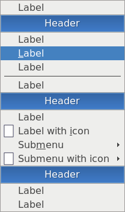

# Menus

With regard to Openbox menus, there are two types: *[static
menus](#Static_menus "wikilink")*, and *[dynamic or "pipe
menus"](#Pipe_menus "wikilink")*.

Both can be configured to extend the functionality of an Openbox
installation. While static menus are built from XML files, pipe menus
are written in various scripting/programming languages and can be used
to provide dynamic menu content like weather, recently accessed files
and RSS feeds. Pipe menus can even be combined with command-line ui
toolkit utilities like zenity or kdialog to completely replicate the
functionality of system tray applets like nm-applet.

Menus can further be bound to keybindings to enable the use of multiple
menus in an Openbox installation. The only real constraint on your
desktop experience is your scripting ability.

## Static menus

Static menus are built based on content of XML files, paths to which
specified in configuration file "`rc.xml`". The default menu file,
"`menu.xml`", located either at "`~/.config/openbox`" (user-specific
directory) or at "`/etc/xdg/openbox`" (system-wide directory) is static
by default.

### Syntax

A menu file must be entirely enclosed within "<openbox_menu>" and
"</openbox_menu>" tags, as well as the appropriate XML declaration like
so:

<?xml version="1.0" encoding="utf-8"?>

<openbox_menu ns="http://openbox.org/" xmlns:xsi="http://www.w3.org/2001/XMLSchema-instance" xsi:schemaLocation="http://openbox.org/ file:///usr/share/openbox/menu.xsd">
`  ...menu stuff here...`
</openbox_menu>

Inside these tags, menus are specified as follows:

<menu
   id="[[#ID|ID]]"
   label="[[#TITLE|TITLE]]"
   icon="[[#ICON|ICON]]"
 >

`  `<item
     label="[[#LABEL|LABEL]]"
     icon="[[#ICON|ICON]]"
   >
`    `[`ACTIONS`](#Actions "wikilink")
`  `</item>

`  `
`  `<separator
     label="Header"
   />

`  `
`  `

<menu
     id="[[#ID|ID]]"
   />

`  `<separator />

`  `
`  `

<menu
     id="[[#ID|ID]]"
     label="[[#TITLE|TITLE]]"
     icon="[[#ICON|ICON]]"
   >

`    `<item
       label="[[#LABEL|LABEL]]"
       icon="[[#ICON|ICON]]"
     >
`      `[`ACTIONS`](#Actions "wikilink")
`    `</item>
`  `

</menu>

`  `<separator />

`  `
`  `<item
     label="[[#LABEL|LABEL]]"
     icon="[[#ICON|ICON]]"
   >
`    `[`ACTIONS`](#Actions "wikilink")
`  `</item>

</menu>

The example above shows how to put entries into a menu (with "<item>"
and "</item>" tags), and two methods to add submenus to a menu (with
"<code>

<menu>

</code>" and "<code>

</menu>

</code>" tags). It also shows how to put menu headers and separators
(with "<separator />" tag) into the menu to group items together without
submenus.

#### Value of attribute "id"

Each menu must be given an **`id`**, which is a unique identifier of the
menu. This **`id`** is used to refer to the menu in a
[ShowMenu](Help:Actions#ShowMenu "wikilink") action.

#### Value if attribute "title"

The value of attribute **`title`** of the menu is shown, when you link
to the menu as a submenu. The **`title`** will appear in its parent
menu.

#### Value of attribute "label"

The value of attribute **`label`** of an "`item`" element is the visible
name of the menu item. In the "`separator`" element, the **`label`**
attribute transforms the separator from a small horizontal line to a
menu header with the given text in it.

##### Specifying menu shortcuts

The first character in the label is used for a keyboard shortcut to
directly use the menu item. This can be overridden by using the "`_`"
character in front of the character, you wish to use for the shortcut.
For example, "`The _shortcut`" would make "`s`" the shortcut key for
this menu item. If you want a "`_`" character to appear in the string,
you can use two underscores together, such as in "`An __ underscore`".

#### Value of attribute "icon"

The value of attribute **`icon`** is path to the image file. Image will
be drawn left of menu item label or submenu label. Supported formats of
images is the same, as formats, supported by libraries
"[Imlib2](https://docs.enlightenment.org/api/imlib2/html/)" (xpm, gif,
jpeg, png) and "[librsvg](https://github.com/GNOME/librsvg)" (svg).
Example:

<item
   label="Vim"
   icon="/usr/share/pixmaps/vim-32.xpm"
 >
`  `<action
     name="[[Help:Actions#Execute|Execute]]"
   >
`    `<execute>`x-terminal-emulator -T Vim -e vim`</execute>
`  `</action>
</item>

If user doesn't want to display icons in menus, he/she can disable icons
inside "`menu`" element in "`rc.xml`" file:

    <menu>
      ...
      <showIcons>no</showIcons>
      <!-- Default value is "yes". -->
      ...
    </menu>

#### Actions

The **ACTIONS** are zero or more
[actions](Help:Actions#Action_syntax "wikilink"), which are executed in
order, when you select the menu item. Typically, in menus, these are
[Execute](Help:Actions#Execute "wikilink") actions, which run commands.

## Pipe menus

Pipe menus are menus generated dynamically based on output of scripts,
they are so-called since the script's output is piped to the given
Openbox menu. A number of scripts used to generate pipe menus are
available through the [pipe menus page](Openbox:Pipemenus "wikilink").

A pipe menu can be created by placing the following code into a menu
file, such as "`menu.xml`":

<?xml version="1.0" encoding="utf-8"?>

<openbox_menu ns="http://openbox.org/" xmlns:xsi="http://www.w3.org/2001/XMLSchema-instance" xsi:schemaLocation="http://openbox.org/ file:///usr/share/openbox/menu.xsd">
` ...menu stuff here...`
` `

<menu
    id="[[#ID|ID]]"
    label="[[#TITLE|TITLE]]"
    execute="[[#Command|COMMAND]]"
  />

</openbox_menu>

Thereafter the pipe menu can be referenced by [ID](#ID "wikilink") just
like static menu.

### Command

The **COMMAND** is the command to be executed by Openbox. Each time
action [ShowMenu](Help:Actions#ShowMenu "wikilink") is executed Openbox
will do the following steps:

- run specified command;
- read output of command;
- show the menu on the screen.

The stdout (output) of the script should be XML, something like:

<openbox_pipe_menu>
`  `<item
     label="[[#LABEL|LABEL]]"
     icon="[[#ICON|ICON]]"
   >
`    `[`ACTIONS`](#Actions "wikilink")
`  `</item>
</openbox_pipe_menu>

When writing your own scripts, make sure to escape xml special
characters, such as "&" ("`&`"), "\<" ("`<`"), "\>" ("`>`") and other
(see more on
[Wikipedia](https://en.wikipedia.org/wiki/List_of_XML_and_HTML_character_entity_references)).

# The Debian menu

Source installs or prepackaged .debs from openbox.org will not configure
your setup to show the Debian menu. There are a few [simple
steps](Help:Menus/Debian-menu "wikilink") to get it working.