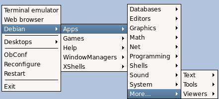

# Debian menus



Source installs or prepackaged .debs from openbox.org will not configure
your setup to show the Debian menu. There are a few simple steps to get
it working.

## If you have already installed openbox with a working Debian menu

Add the following line to your `~/.config/openbox/menu.xml` file
(if it isn't there, copy it from `/etc/xdg/openbox/menu.xml` file):

```xml
<menu id="/Debian" />
```

You should place the line, where you would like it to appear in the root
menu. Location matters!

Add one of following lines to your `~/.config/openbox/rc.xml` file
between the `<menu>` and `</menu>` tags, before the code `<file>menu.xml</file>`:

```xml
<file>/var/lib/openbox/debian-menu.xml</file>
<file>debian-menu.xml</file>
```

The second line allows you to copy the `debian-menu.xml` file from
`/var/lib/openbox` to your local `~/.config/openbox` directory,
where it becomes static (command `update-menus` will not affect it).
You can then edit it by hand and your changes will be permanent.

That's all you should have to do, though it's a good idea to run command
`update-menus` (from package `menu`) as root every now and then, if you don't
have a cron job assigned. It refreshes the list of currently installed apps.

Then choose `reconfigure` on your root menu,
and you should get a Debian submenu within the root menu.

## If you haven't had a working debian menu

This is a little trickier, but no big deal.

Then there's this little humdinger: you'll need to get a copy of an executable
script named `openbox` and copy it to `/etc/menu-methods` directory.
The script actually creates the Debian menu, when you run `update-menus`.

**Method 1**

The easiest way is to install Openbox from official debian repository
using `apt`, `aptitude`, `synaptic` or other program. This will
normally ensure, that you have all the packages required to create and
use the Debian menu.

After installation copy the script (from `/etc/menu-methods`
directory) in a known directory (your home directory will fine), then uninstall
the official openbox (with `apt`, `aptitude`, `synaptic` or other).

Then, copy the script back to `/etc/menu-methods` directory and
finally, issue the command `update-menus` as root.

**Method 2**

If you don't want to do that, download an official Openbox package
(.deb) from debian.org, create a dummy directory in `/tmp` and type
the command

` dpkg-deb -x /path/to/official-openbox.deb < /tmp/dummy_dir`

This will unpack a mini-filesystem, that includes the script you need,
in `/tmp/dummy_dir/etc/menu-methods` directory. Set its execution
permissions, copy the script to `/etc` directory and issue the command
`update-menus` as root. The latter command will create the file
`/var/lib/openbox/debian-menu.xml`.

To set the execution permissions type:

` chmod ug+x /tmp/dummy_dir/etc/openbox`

The reason to create a dummy directory is that running the `dpkg-deb -x`
command will change the ownership of the directory to root. These could
become a bit of a problem later; putting it in a subdirectory of
`/tmp` makes that issue, inoffensive.

Also, you should make sure you have the following packages installed
before running `update-menus`:

- menu;
- menu-xdg.

Now follow the instructions, listed
[above](#if-you-have-already-installed-openbox-with-a-working-debian-menu).
