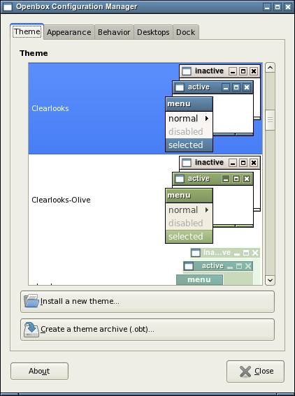
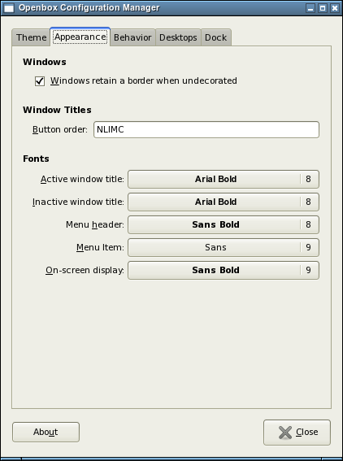
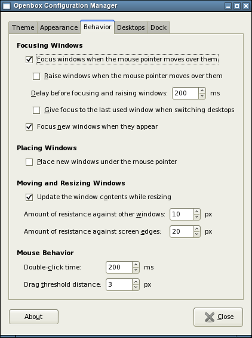
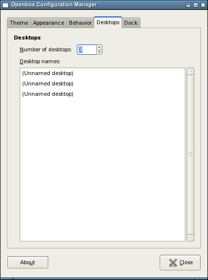
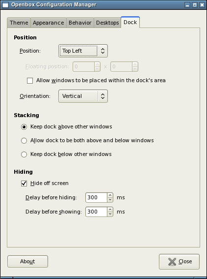

# About

This page is about the Openbox configuration tool, ObConf 2.0.

## Installing and distributing Openbox themes

ObConf now easily installs new themes which use the `.obt` Openbox theme
archive format for distribution. Just open any `.obt` theme archive in
your file browser, or use the interface provided inside ObConf.

You can also use ObConf to create `.obt` Openbox theme archives for
distributing your own themes.

## Screenshots







## Download

ObConf is available for [download here](../Download.md#obconf-openbox-configuration-tool).<br />
The current changelog is [found here](Changelog.md).

## Installing ObConf

ObConf should be installed to the `/usr` prefix to have file
associations function correctly.

When ObConf is installed, upgraded or uninstalled, you need to run these
commands to update the `.obt` file associations for GNOME:

```bash
update-mime-database /usr/share/mime
update-desktop-database /usr/share/applications
```

These programs are a part of the `shared-mime-info` and `desktop-file-utils` packages.
They should be installed if GNOME is installed.

### Dependencies

Compiling ObConf requires the following packages:

- GTK+ 2.x library and headers (development package)
- Glade 2.x library and headers (development package)
- Openbox 3.4 or above (the libraries development package if it is separate)

### Building ObConf

If you have installed Openbox into the `/usr/local` prefix, you will
need to tell the ObConf configure script where to find the Openbox
libraries:

```bash
PKG_CONFIG_PATH=/usr/local/lib/pkgconfig ./configure --prefix=/usr
```
