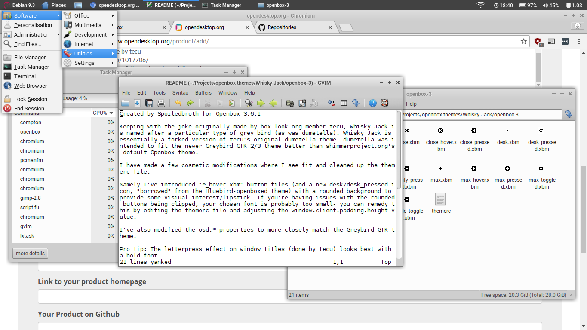

# Spoiledbroth

Hi. I'm Spoiledbroth. I write bad code and use openbox. I like minimalism.

I hope to leave some scripts, pipemenus, and short tutorials on this page.

## Desktop integration tips

- Employ [the xdotool pattern](xdotool.md) to integrate multiple Openbox menus.
- Integrate window tiling into your Openbox desktop with [X-Tile](x-tile.md).

## Examples

- [Basic X-Tile menu example](x-tile.md) (static menu)

## Scripts

- [Chromium bookmarks](ob-chromium.md) (perl pipemenu)

## Themes

- **[Whisky Jack](https://www.box-look.org/p/1218877/)** - an Openbox 3 theme
  to fit the stock **Greybird** GTK 2/3 theme by shimmerproject.org (XFCE)
- **[Vedanta-dark](https://www.box-look.org/p/1218937/)** - an Openbox 3 theme
  to fit the stock **Adwaita-dark** GTK 2/3 theme-variant by the GNOME Project

## Recommended software

### General desktop environment

- [Feh](https://feh.finalrewind.org/) - console-friendly image viewer, set desktop images w/ multihead support
- [gsimplecal](https://dmedvinsky.github.io/gsimplecal/) - lightweight configurable GTK calendar applet written in C++
- [neap](https://github.com/vzxwco/neap/) - X11 systray workspace pager
- [gmrun](https://sourceforge.net/projects/gmrun/) - Featureful GTK application runner with tab auto-completion.

### Openbox-related

- [obamenu](https://rmoe.anukis.de/obamenu.html) - openbox application automenu written in python

### Other software

- [Mopidy](https://www.mopidy.com/) - extensible python music server w/ multiple web backends, supports mpd clients
- [folder2ram](https://github.com/bobafetthotmail/folder2ram/) - simple utility to bind mount directories to tmpfs/sync to disk to reduce write activity on SSD/eMMC drives
