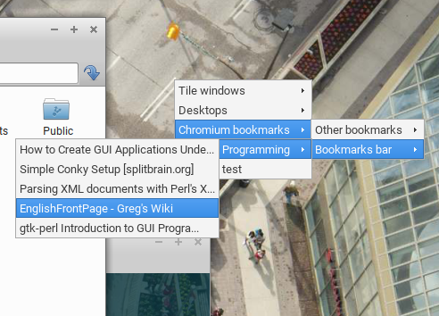

# ob-chromium


Here is a pipemenu for displaying your chromium bookmarks.
Commented throughout. Depends on Perl module **JSON::Tiny**.

I encase the bookark URL itself within a `<[!CDATA[ ]]>` block and
encode any HTML entities in bookmark/folder titles as some kind of basic
sanity checking before output. Just to keep things kosher.

```perl
#!/usr/bin/perl

# openbox-chromium 1.01-beta - openbox chrome browser bookmarks pipemenu
# Copyright (C) 2018 http://openbox.org/wiki/User:Spoiledbroth
#
# This program is free software: you can redistribute it and/or modify
# it under the terms of the GNU General Public License as published by
# the Free Software Foundation, either version 3 of the License, or
# (at your option) any later version.
#
# This program is distributed in the hope that it will be useful,
# but WITHOUT ANY WARRANTY; without even the implied warranty of
# MERCHANTABILITY or FITNESS FOR A PARTICULAR PURPOSE.  See the
# GNU General Public License for more details.

# === DEPENDENCIES: ===
# JSON::Tiny - http://search.cpan.org/~davido/JSON-Tiny-0.58/lib/JSON/Tiny.pod
use strict;
use warnings;
use JSON::Tiny qw(decode_json);
use IO::File;
use HTML::Entities qw(encode_entities);

# === CONFIGURATION: ===
# $bookmarks - Location of your chromium/google-chrome bookmarks.
# You can try "find ~/.config -name Bookmarks" if you're having finding it.
# $browser - browser command, either x-www-browser, chromium or google-chrome
# $maxlength - upper limit of characters for bookmark titles

my $bookmarks = "./config/chromium/Profile 1/Bookmarks";
my $browser = "chromium";
my $maxlength = 35;

# Lets open up that bookmarks file
my $file = do {
  local $/ = undef;
  open my $fh, "<", $bookmarks
    or die "could not open $bookmarks: $!";
  <$fh>
};

# Now, get the bookmark JSON into a reference
my $data = decode_json $file;
# Remove sync transaction infos... causes the script to blow up.
delete $data->{'roots'}->{'sync_transaction_version'};
# Cast that reference to a hash of the 'roots' entries in the bookmark file.
my %json = %{$data->{'roots'}};
# ... so we only loop over what we need, essentially.

# Build the Openbox menu header
print "<?xml version=\"1.0\" encoding=\"utf-8\"?>\n"
  . "<openbox_pipe_menu>\n";
# Main program loop...
foreach (keys %json)
{
  traversal ($data->{'roots'}->{$_});
}
# End of menu
print "</openbox_pipe_menu>\n";

# Recursion function for bookmark "folders"
sub traversal
{
  my ($obtained) = @_;
  # If the entry is a folder with >0 children, build an entry and recurse
  if (($obtained->{'type'} eq "folder") &&
    (0+@{$obtained->{'children'}} != 0) &&
    ($obtained ne "sync_transaction_version")) {
    build_entry($obtained);
    my @children = @{$obtained->{'children'}};
    foreach my $i (0 .. $#children)
    {
      #delete $children[$i]->{'sync_transaction_version'}
      traversal($children[$i]);
    }
    print "</menu>\n"; # I'm not perfect...
  # Else, we need to build an entry for a URL.
  } elsif ($obtained->{'type'} eq "url") {
    build_entry($obtained);
  }
  return;
}

# Function to build the menu (seperation of concerns)
sub build_entry
{
  my ($entry) = @_;
  if ($entry->{'type'} eq "folder") {
    # print case for bookmark folder
    print " <menu id=\""
      .$entry->{'id'}."\" label=\"".encode_entities($entry->{'name'})."\">\n";
  } elsif ($entry->{'type'} eq "url") {
    # print case for bookmark link
    my $truncated = scalar $entry->{'name'};
    $truncated =~ s/^(.{1,$maxlength})(.+)?/$1 . (defined $2 ? "..." : "")/e;
    print "  <item label=\"".encode_entities($truncated)."\">\n"
      . "  <action name=\"Execute\">\n"
      . "    <execute>\n"
      . "    ".$browser." <![CDATA[".$entry->{'url'}."]]>\n"
      . "    </execute>\n"
      . "  </action>\n"
      . "  </item>\n";
  }
  return;
}
```
